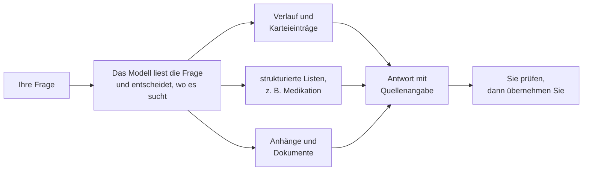
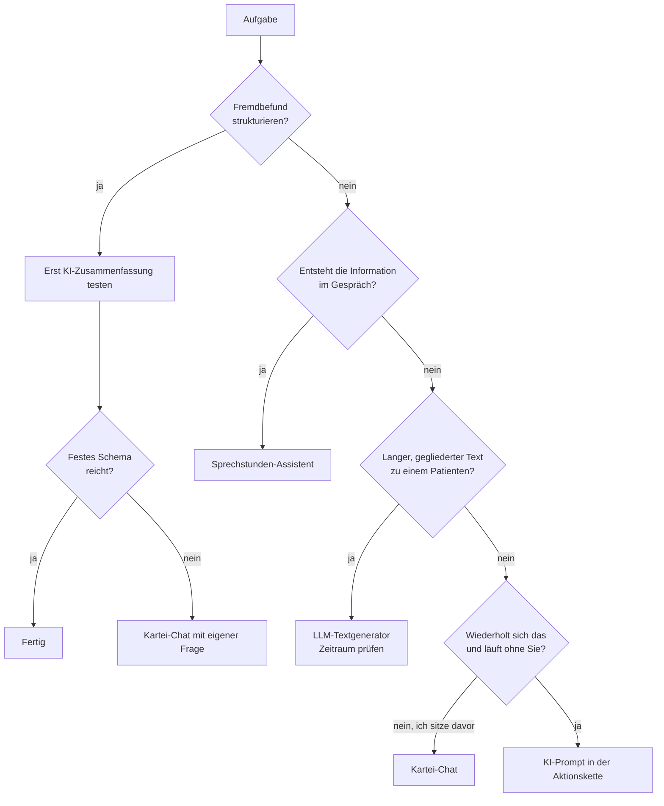
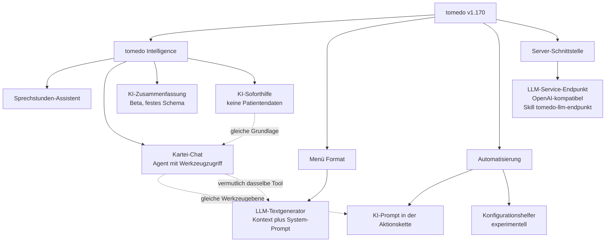
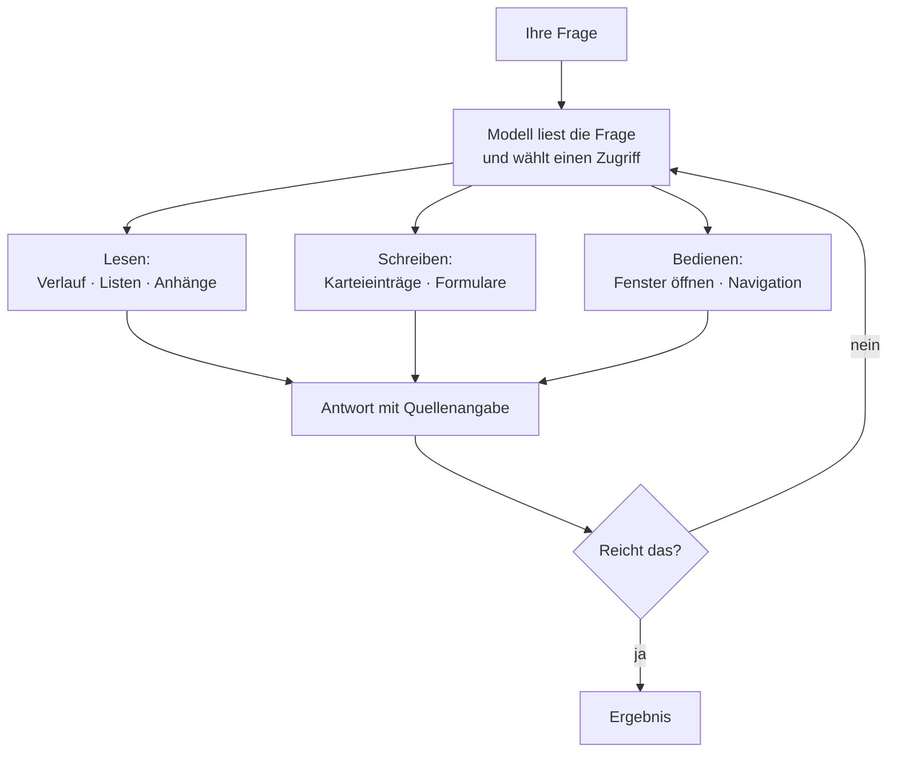
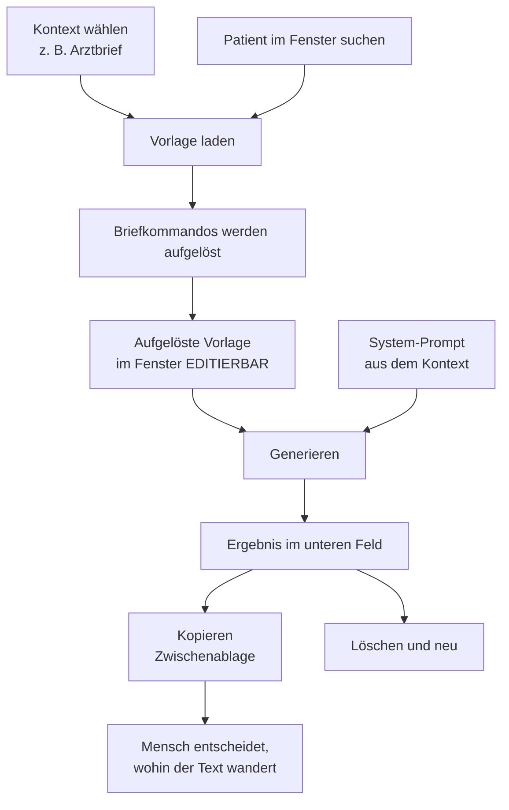
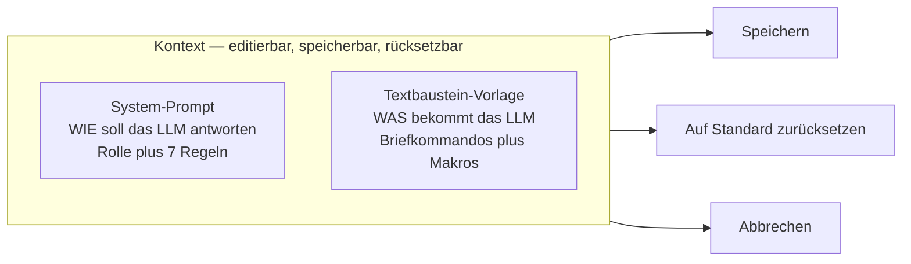
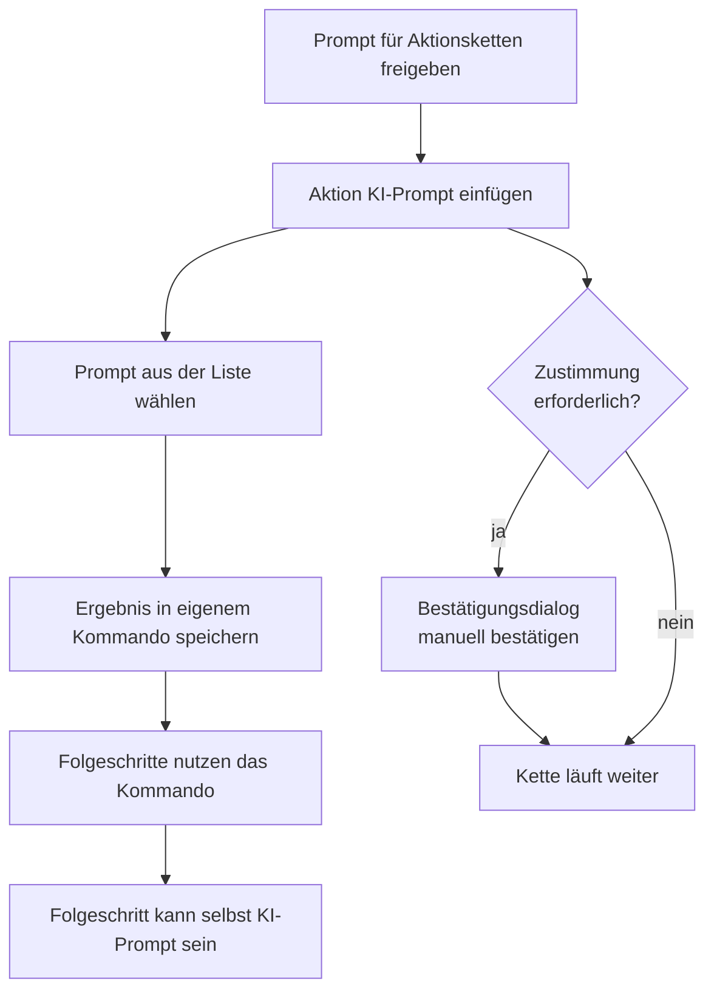
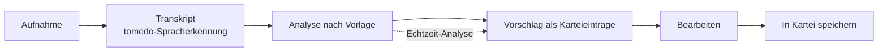
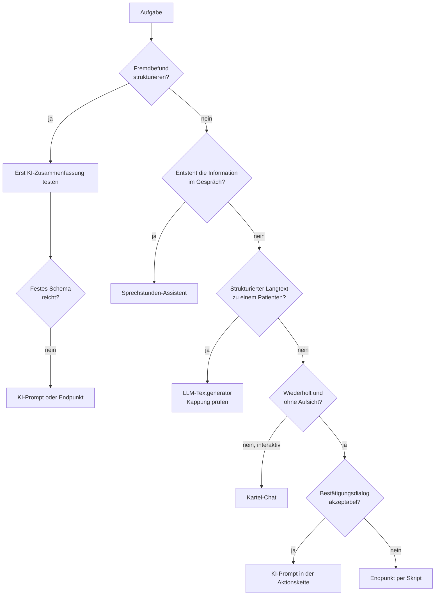
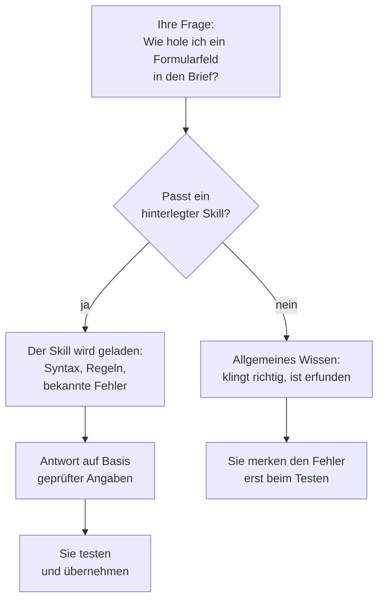

# tomedo-KI-Handbuch

Diese Datei fasst die drei Teile des Handbuchs zusammen — dieselben Inhalte wie die
HTML-Fassung, nur als Markdown zum Weiterverarbeiten, Zitieren und Korrigieren.

> **Geltungsbereich.** Aussagen der Form „an der Referenzinstallation leer", „nicht
> gepflegt" oder „X von Y" beschreiben **eine** produktive tomedo-Installation zum
> genannten Zeitpunkt. Sie sind ein Hinweis darauf, dass etwas unzuverlässig sein *kann* —
> keine Eigenschaft von tomedo. Vor Verwendung in der eigenen Praxis nachmessen.

> **Nicht enthalten:** Teil 4 zum LLM-Service-Endpunkt (nur Praxis-IT). Er steht in der
> HTML-Fassung und im PDF.

---

# Teil 1 · Anwenderhandbuch

**Für wen.** Für alle, die die KI-Funktionen in tomedo benutzen: Medizinerinnen und
Mediziner, MFA, Schmerzassistenz, Praxismanagement. Es setzt keine IT-Kenntnisse
voraus und verwendet keine Fachsprache aus der KI-Entwicklung.

**Worum es geht.** Jedes der sechs KI-Werkzeuge in tomedo hat einen engen
Einsatzzweck und klare Grenzen. Wer beides kennt, spart Zeit. Wer es nicht kennt,
erzeugt Texte, die überzeugend aussehen und nicht stimmen. Dieses Handbuch ordnet
deshalb jedem Werkzeug drei Dinge zu: **wofür es gedacht ist**, **welche Aufgaben
es tatsächlich löst** und **wo es aufhört**.

**Die beiden anderen Teile.** Teil 2 erklärt, warum die Dinge so sind, mit Messung
und Quelle. Teil 3 beschreibt Skills — vorbereitete Arbeitsanleitungen für KI
außerhalb von tomedo.

---

## 1 · Wie die KI in tomedo arbeitet

Sie stellen eine Frage. Ein Sprachmodell liest sie, sucht sich die passenden Daten
aus Ihrer Praxissoftware zusammen und formuliert eine Antwort. Der entscheidende
Punkt ist der mittlere Schritt: **das Modell entscheidet selbst, wo es nachsieht.**



Daraus folgen drei Dinge, die den ganzen Umgang mit diesen Werkzeugen bestimmen.

**Ihre Wortwahl steuert die Suche.** Klingt Ihre Frage nach Medikation, sieht das
Modell in der Medikationsliste nach — und nur dort. Steht die gesuchte Angabe in
einem Verlaufstext, findet es sie dann nicht.

**Ein „Nein" ist kein Beweis.** Es heißt nur: an der Stelle, an der nachgesehen
wurde, stand nichts. Es heißt nicht, dass es nichts gibt.

**Das Modell prüft nicht, es formuliert.** Es erkennt nicht, ob eine Angabe fehlt.
Wo eine Lücke ist, schreibt es etwas Passendes hin. Deshalb steht am Ende jedes
Ablaufs Ihre Prüfung, und deshalb ist sie nicht wegzulassen.

---

## 2 · Die sechs Werkzeuge im Überblick

| # | Werkzeug | Einsatzzweck in einem Satz | Sieht die Akte | Schreibt hinein |
|---|---|---|:---:|:---:|
| 1 | KI-Soforthilfe | Fragen zur Bedienung von tomedo beantworten | nein | nein |
| 2 | Kartei-Chat | aus der Akte eines Patienten Auskunft geben oder Text erzeugen | ja | ja, nach Bestätigung |
| 3 | Sprechstunden-Assistent | ein Gespräch als Karteieintrag vorschlagen | ja | ja, nach Freigabe |
| 4 | (KI-) Zusammenfassung | einen gespeicherten Brief in ein festes Schema bringen | nur Briefe | ja, nach Bestätigung |
| 5 | LLM-Textgenerator | aus Vorlagendaten einen längeren Text bauen | über die Vorlage | nein |
| 6 | KI-Prompt in der Aktionskette | eine wiederkehrende KI-Aufgabe automatisch anstoßen | ja | ja |

**Wo Sie sie finden.** KI-Soforthilfe im Fenster *Hilfe & Supportkontakt*.
Kartei-Chat, Sprechstunden-Assistent und (KI-) Zusammenfassung unter *tomedo
Intelligence*. Der LLM-Textgenerator hängt nicht dort, sondern im Menü **Format** —
das ist die häufigste Sucherei. Der KI-Prompt steckt in der Aktionsketten-Konfiguration
und begegnet Ihnen im Alltag nur als Bestätigungsdialog.



---

## 3 · Die sieben Regeln

1. **Keine Patientendaten in die KI-Soforthilfe.** Sie ist für Fragen zur Bedienung
   von tomedo da und greift auf Handbuch, Wissensdatenbank und Forum zu — nicht auf
   Ihre Akte. <sup>[Teil 2 · §11]</sup>
2. **Nichts speichern, was Sie nicht gelesen haben.** Bei jedem Werkzeug steht
   zwischen Vorschlag und Kartei ein Bestätigungsschritt. Der ist keine Formalie. <sup>[Teil 2 · §10]</sup>
3. **Die KI zählt nicht.** Sie sieht nicht alle Einträge, sondern eine Auswahl. Wenn
   Vollständigkeit zählt, prüfen Sie sie selbst. <sup>[Teil 2 · §9]</sup>
4. **Form erfüllt heißt nicht Inhalt erfüllt.** Eine Antwort kann alle geforderten
   Überschriften haben und trotzdem einen ganzen Abschnitt auslassen. <sup>[Teil 2 · §9]</sup>
5. **Eine Quellenangabe ist kein Echtheitsbeweis.** Eine Aussage ohne Quelle müssen
   Sie prüfen — eine mit falsch zugeordneter Quelle aber auch. <sup>[Teil 2 · §4]</sup>
6. **Bei wichtigen Texten zweimal laufen lassen.** Was sich zwischen zwei Durchläufen
   unterscheidet, ist genau das, was Sie prüfen müssen. <sup>[Teil 2 · §14]</sup>
7. **Bei Störungen ein Ticket, keinen Chat.** Die KI-Soforthilfe ersetzt kein
   Support-Ticket. <sup>[Teil 2 · §8]</sup>

Zwei weitere Regeln lassen sich nicht als Merksatz sagen, sondern nur zeigen. Es
sind die beiden, an denen im Alltag am meisten schiefgeht.

**Regel A · Fragen Sie, statt zu beauftragen.** Der Kartei-Chat darf schreiben. Eine
Formulierung, die wie ein Arbeitsauftrag klingt, kann als Schreibauftrag verstanden
werden.

| So | Besser nicht |
|---|---|
| „**Nenne** alle Vorbefunde mit Datum." | „**Erfasse** alle Vorbefunde." |
| „**Liste** die Medikation **auf**." | „**Trage** die Medikation **zusammen**." |
| „**Gib** die letzten drei Befunde **zurück**." | „**Dokumentiere** die letzten drei Befunde." |

**Regel B · Ein leeres Feld ist gefährlicher als gar kein Feld.** Wenn Sie einen
Platzhalter in eine Frage setzen und der bleibt leer, sehen Sie eine leere Zeile —
das Modell sieht eine Aufgabe und füllt sie. Das Ergebnis ist plausibel, vollständig
und falsch.

| So | Besser nicht |
|---|---|
| Prüfen, ob der Platzhalter gefüllt ist, **bevor** Sie abschicken | Abschicken und erst das Ergebnis anschauen |
| Einen Vorbehaltssatz danebenstellen, siehe Abschnitt 10 | Darauf vertrauen, dass eine Lücke als Lücke erkennbar bleibt |
| Bei leerem Feld den Satz ganz weglassen | Das Feld mit einem Bindestrich „füllen" |

---

## 4 · KI-Soforthilfe

**Einsatzzweck.** Auskunft zur Bedienung von tomedo. Die Wissensbasis sind
Handbuch, Wissensdatenbank und Forum. <sup>[Teil 2 · §8]</sup>

Das ist das einzige KI-Werkzeug, das Sie ohne Vorbereitung benutzen können, und das
einzige, bei dem eine falsche Antwort keinen Schaden in der Akte anrichtet. Deshalb
steht es hier an erster Stelle.

**Dafür geeignet**

| Anwendungsfall | Beispiel |
|---|---|
| Funktion finden | „In welchem Menü lege ich Terminarten an?" |
| Fehlermeldung einordnen | „Was bedeutet die Meldung ‚…' beim Speichern?" |
| Einstellung nachschlagen | „Wo hinterlege ich eine Standarddosierung als Favorit?" |
| Vorgehen erklären lassen | „Wie gebe ich einen Textbaustein für den Kartei-Chat frei?" |
| Begriff klären | „Was ist der Unterschied zwischen Leistungsfavorit und Leistungskette?" |

**Grenzen**

| Grenze | Was das für Sie heißt |
|---|---|
| Keine Patientendaten zulässig | Auch keine Initialen, kein Geburtsjahr, kein Befundtext — Herstellerauflage |
| Kein Zugriff auf Ihre Akte | Sie kann nicht nachsehen, was bei Ihnen dokumentiert ist |
| Kein klinisches Wissen | Dosierungen, Leitlinien, Differentialdiagnosen gehören nicht hierher |
| Kennt Ihre Version nicht von selbst | Kann Funktionen beschreiben, die es bei Ihnen nicht gibt — Version mitnennen |
| Ersetzt kein Ticket | Bei einer Störung führt nur der Supportweg weiter |

**So arbeiten Sie damit.** Fenster *Hilfe & Supportkontakt* öffnen, Frage stellen —
konkret, mit dem Namen der Funktion und dem Wortlaut der Meldung. Den Fall allgemein
beschreiben, ohne Patientenbezug. Für einen neuen Fall den Chat leeren.

**So:**

- Für Fragen zur Bedienung und für Handlungsanweisungen an tomedo nutzen.
- Für einen neuen Fall den Chat leeren.
- Vorkonfigurierte Prompts als Textbausteine hinterlegen — Freigabe getrennt vom Kartei-Chat.

**Besser nicht:**

- Patientendaten oder patientenbezogene Informationen eingeben. Ausdrückliche Herstellerauflage.
- Klinische Fragen stellen — die Wissensbasis ist Handbuch, Wissensdatenbank und Forum.
- Ein Support-Ticket ersetzen, wenn eine Störung vorliegt.

**Woran Sie merken, dass etwas nicht stimmt.** Eine Antwort beschreibt eine Funktion,
die es in Ihrer Version nicht gibt, oder ein Menü, das bei Ihnen anders heißt. Im
Zweifel gegen die Onlinehilfe prüfen.

---

## 5 · Kartei-Chat

**Einsatzzweck.** Auskunft aus der Akte eines geöffneten Patienten — und Texte, die
auf dieser Akte aufsetzen. Das vielseitigste und zugleich das voraussetzungsreichste
Werkzeug. <sup>[Teil 2 · §4]</sup>

**Dafür geeignet**

| Anwendungsfall | Beispiel |
|---|---|
| Verlauf überblicken | „Nenne alle Einträge der Typen ANA, BEF und THER der letzten vier Quartale mit Datum." |
| Bestimmte Angabe suchen | „In welchen Einträgen ist eine Infiltration dokumentiert?" |
| Vor dem Termin vorbereiten | „Was ist seit dem letzten Kontakt dokumentiert?" |
| Kurzbericht entwerfen | „Schreibe einen Kurzbericht an den Hausarzt, drei Absätze." |
| Zuarbeit für Anträge | „Nenne alle dokumentierten Therapieversuche mit Zeitraum und Ergebnis." |
| Fremdbefund erschließen | „Nenne alle im Anhang genannten Messwerte mit Einheit und Datum." |
| Eintrag anlegen | „Lege einen Karteieintrag vom Typ BEF mit dem heutigen Datum an." |

**Grenzen**

| Grenze | Was das für Sie heißt |
|---|---|
| Sucht dort, wo Ihre Wortwahl hinzeigt | Nennen Sie die Karteieintragstypen, sonst rät das Modell |
| **„Nicht dokumentiert" ist keine Auskunft über die Akte** | Steht der Wert nur in einem Anhang, meldet er ihn als fehlend — und sagt nicht dazu, dass er dort nicht nachgesehen hat. Bei Werten aus Fremdbriefen den Anhang ausdrücklich nennen |
| **Er rechnet nicht gegen** | Steht in der Akte eine falsche Zahl, kommt sie unverändert zurück. Er bestätigt eine Angabe nicht — er gibt sie weiter |
| Zeitangaben steuern die Suche nicht zuverlässig | Lassen Sie jedes Datum mitausgeben und prüfen Sie den Zeitraum selbst |
| Keine Vollständigkeitsgarantie | Für Zählungen und Statistiken ungeeignet |
| Keine Bewertung, keine Diagnose | Vom Einsatzzweck nicht gedeckt — er gibt wieder, er beurteilt nicht <sup>[Teil 2 · §10]</sup> |
| Eine Aufgabe pro Frage | Zwei Aufgaben ergeben meist eine halbe Antwort auf beide |
| Der Verlauf wirkt nach | Vor einer neuen Aufgabe den Chat leeren |
| Darf schreiben | Eine als Auftrag lesbare Abfrage kann etwas anlegen |

**So arbeiten Sie damit.**

1. Akte öffnen, Kartei-Chat öffnen.
2. Wenn es eine vorbereitete Frage für Ihre Aufgabe gibt, diese aus der Liste wählen.
3. Frage stellen — eine Aufgabe.
4. Antwort lesen, Quellenangaben aufklappen, gegen die Akte halten.
5. Erst dann übernehmen.
6. Vor der nächsten, anderen Aufgabe den Chat leeren.

**So:**

- Typdefinition setzen — den Fachbegriff der Frage in Karteieintragstypen ausdrücken. Der wirksamste Baustein: 3/3 richtig statt 3/3 falsch.
- Einen Vorbehaltssatz ergänzen, sobald ein fester Wert im Prompt steht: der vorgegebene Wert kann unvollständig oder veraltet sein und ist gegen die Akte zu prüfen.
- Abfragen in Frageform stellen — „nenne“, „liste auf“, „gib zurück“.
- Prompts als reine Textbausteine ablegen und über den Reiter Sichtbarkeit freigeben; `___` lässt eine Stelle offen.
- Jede Aussage über die Quellenverknüpfung öffnen und gegenlesen.
- Beim Anlegen eines eigenen Karteieintragstyps den Variablennamen des Feldes angeben.
- Zwischen Läufen den Chat leeren — sonst wirken Rückbezüge auf die vorige Antwort fort.

**Besser nicht:**

- Einen leeren oder falsch beschrifteten Platzhalter stehen lassen. Der gefährlichste Fehler: er wird lautlos gefüllt, in drei von drei Läufen falsch und jedes Mal gleich.
- Einen kompletten Textblock als feste Vorgabe mitgeben — dann durchsucht das Modell die Kartei gar nicht mehr.
- Frage-Antwort-Makros in Chat-Prompts verwenden: sie werden als Rohtext weitergereicht.
- Score-Felder oder nicht bearbeitbare zusammengesetzte Textfelder beim Anlegen eigener Karteieinträge angeben.
- „Erfasse“, „trage zusammen“, „lege dar“ in eine Abfrage schreiben — als Schreibauftrag lesbar.
- Eine Zeitangabe im Prompt für eine Abrufsteuerung halten: der Kartei-Abruf kennt nur eine Datumsgrenze.
- Einen Prompt in der KI-Assistenten-Verwaltung löschen, wenn der Textbaustein bleiben soll — er wird mitgelöscht.
- Die Behandler-Attribution ungeprüft übernehmen.

**Woran Sie merken, dass etwas nicht stimmt.** Ein Datum, das es in der Akte nicht
gibt. Eine Diagnose, die zu gut zur Frage passt. Eine Aussage ohne Quellenangabe. Ein
Behandlername, der nicht stimmt. Eine Antwort, die auffällig länger oder kürzer ausfällt
als sonst — dann ist etwas anders gelaufen. **Auch eine ungewöhnlich lange Antwort ist ein
Warnzeichen**, nicht nur eine kurze. Und: eine Erfolgsmeldung ist kein Nachweis.
„Erfolgreich erstellt, einschließlich Anhang" kam zurück — die Datei war trotzdem nicht in
der Akte. <sup>[Teil 2 · §14]</sup>

### Den Wert mitgeben, statt ihn suchen zu lassen

Bisher ging es darum, dass der Chat Ihre Akte durchsucht. Es gibt einen zweiten Weg: Sie geben
ihm den Wert gleich mit.

Dafür fügen Sie ein **Briefkommando** in das Eingabefeld ein — dasselbe `$[…]$`, das Sie aus
Briefvorlagen kennen. tomedo ersetzt es dort nach einer halben Sekunde durch den Wert aus der
Akte. Der Chat muss dann nicht mehr suchen. Er sieht den Wert einfach.

**Was Sie davon haben.** Das Ärgernis „er findet es nicht, obwohl es dasteht" verschwindet —
für alles, was bei Ihnen ordentlich in Feldern steht.

**Was sich dadurch nicht ändert.** Er rechnet weiterhin nicht nach. Wir haben ihm eine Akte mit
einem falschen Rechenergebnis vorgelegt, alle Daten sichtbar im selben Fenster: Er hat die
falsche Zahl übernommen und nichts gemerkt.

**Deshalb schreiben Sie einen Satz dazu:**

> Prüfe die Angabe gegen die Datumsangaben oben. Weicht sie ab, benenne die Abweichung
> ausdrücklich und nenne beide Zahlen.

Mit diesem Satz fiel der Fehler fast immer auf. Ohne ihn kein einziges Mal. Beides zusammen
wirkt: der Wert vor Augen **und** der ausdrückliche Auftrag, ihn zu prüfen.

**Zwei Dinge, die Sie wissen sollten.**

- **Briefkommandos lesen keine Anhänge.** Steht der Wert nur in einem eingescannten Fremdbrief,
  hilft nur der normale Weg — den Chat danach fragen und den Anhang ausdrücklich erwähnen.
- **Ein Kommando liefert nur, was bei Ihnen wirklich in Feldern steht.** Was nur im Freitext
  steht, kommt nicht — und zwar kommentarlos. Lassen Sie sich jedes Kommando einmal ausgeben,
  bevor Sie sich darauf verlassen.

**Und die gute Nachricht dazu.** Wir haben dieselbe Akte zweimal geprüft — einmal vorher und
einmal, nachdem die Medikation, die Arbeitsunfähigkeit und die Diagnosen ordentlich in die
Felder eingetragen waren. Vorher konnte der Chat mit zwei Datenarten arbeiten, danach mit fünf.
**Am Chat hatte sich nichts geändert, nur an der Dokumentation.** Was Sie sauber eintragen,
können Sie hinterher verwenden — was Sie in den Fließtext schreiben, nicht.

**Und ganz praktisch:** Diese Kommandos tippt niemand auswendig, den Prüfsatz auch nicht. Legen
Sie beides einmal als Textbaustein an. Danach ist es ein Klick.

---

## 6 · Sprechstunden-Assistent

**Einsatzzweck.** Das Gespräch wird aufgenommen, verschriftlicht und nach einer
hinterlegten Vorlage zu Karteieintrags-Vorschlägen verarbeitet. <sup>[Teil 2 · §6]</sup>

**Dafür geeignet**

| Anwendungsfall | Beispiel |
|---|---|
| Erstgespräch mitschreiben | Anamnese, Beschwerden, Vorbehandlungen |
| Verlaufskontrolle | Veränderung seit dem letzten Termin |
| Aufklärungsgespräch dokumentieren | was besprochen und vereinbart wurde |
| Angaben des Patienten festhalten | Medikation, wie vom Patienten berichtet |

**Grenzen**

| Grenze | Was das für Sie heißt |
|---|---|
| Die Vorlage bestimmt das Ergebnis, nicht Ihr Gespräch | Passt die Gliederung nicht, gehört die Vorlage angepasst |
| Nur Text-Karteieinträge | Strukturierte Felder werden nicht befüllt |
| Keine Deutung, keine Diagnosestellung | Er gibt wieder, was gesagt wurde |
| Nicht auf tomedo iOS verfügbar | Am iPad steht das Werkzeug nicht zur Verfügung |
| Einwilligung ist Ihre Aufgabe | Die Software holt sie nicht ein |

**So arbeiten Sie damit.** Patient informieren und Einwilligung einholen. Aufnahme
starten, Gespräch führen. Die Analyse läuft nach der Vorlage. Vorschläge durchsehen,
korrigieren, speichern.

**So:**

- Das neue Analyseverfahren aktivieren — nur damit dürfen eigene Vorlagen Briefkommandos enthalten.
- Die Beschreibung je Karteieintrag als Steuerungsort nutzen: dort gehören Gliederungsachse und Formatvorgabe hin.
- Die Option „Entpersonalisiert“ und den erweiterten Prompt vor dem Rollout durchtesten.
- Gegen die eigenen Audio-Prompts vergleichen, bevor weiter an ihnen gebaut wird (F10).

**Besser nicht:**

- Auf tomedo iOS damit rechnen — dort nicht verfügbar.
- Andere als Text-Karteieinträge in Vorlagen erwarten.
- Den Vorschlag ungeprüft speichern.
- Eine Interpretation oder Therapieableitung erwarten — dieselbe Zweckbestimmung wie beim Kartei-Chat schließt das aus.

**Woran Sie merken, dass etwas nicht stimmt.** Inhalte, die im Gespräch nicht
vorkamen. Zuordnungen zum falschen Karteieintragstyp. Eine Einordnung statt einer
Wiedergabe.

---

## 7 · (KI-) Zusammenfassung

**Einsatzzweck.** Einen gespeicherten Arztbrief — typischerweise einen Fremdbefund —
in ein festes Schema bringen: Diagnosen, Medikation, Prozeduren, Procedere. Das
Werkzeug ist als Beta gekennzeichnet. <sup>[Teil 2 · §7]</sup>

**Dafür geeignet**

| Anwendungsfall | Beispiel |
|---|---|
| Entlassbrief erschließen | Diagnosen und Medikation auf einen Blick |
| Langen Fremdbefund sichten | vor der ausführlichen Lektüre |
| Übergabe vorbereiten | Procedere aus einem Klinikbrief |

**Grenzen**

| Grenze | Was das für Sie heißt |
|---|---|
| Das Schema ist fest | Schlaflaborwerte, Druckwerte, schmerzspezifische Parameter kommen nicht vor |
| Kein Anlernen, keine Anweisungen | Es gibt keine Frage, die Sie stellen könnten |
| Kein Nachfassen | Passt es nicht, neu zusammenfassen statt nachbessern |
| Nur gespeicherte Briefe | Nicht für Karteieinträge oder freie Texte |

**So arbeiten Sie damit.** Brief öffnen, Zusammenfassung anstoßen, Ergebnis prüfen,
bestätigen.

**So:**

- Vor jedem Eigenbau an echten Reha- und Klinikbriefen testen (F9).
- Das Ergebnis prüfen, bestätigen und erst dann speichern.
- Bei unbefriedigendem Ergebnis neu zusammenfassen statt nachzubessern.

**Besser nicht:**

- Ein Anlernen erwarten — gibt es nicht.
- Ein eigenes Schema erwarten: Diagnosen, Medikation, Prozeduren, Procedere sind fest. AHI, ESS, Druckwerte oder schmerzspezifische Parameter kommen nicht vor.
- Die eigene Extraktionsstrecke abschalten, bevor F9 beantwortet ist.

**Woran Sie merken, dass etwas nicht stimmt.** Es fehlt etwas, das im Brief steht —
das ist meist kein Fehler, sondern das Schema. Wenn Sie solche Werte brauchen, nehmen
Sie den Kartei-Chat.

---

## 8 · LLM-Textgenerator

**Einsatzzweck.** Längere, gegliederte Texte zu einem Patienten. Der einzige Weg, bei
dem Sie **vor** dem Erzeugen sehen, welche Daten das Modell bekommt. <sup>[Teil 2 · §3]</sup>

**Dafür geeignet**

| Anwendungsfall | Beispiel |
|---|---|
| Arztbrief entwerfen | Rohfassung über einen überschaubaren Zeitraum |
| Ämteranfrage beantworten | wenn die Datenlage vorher geprüft werden soll |
| Wiederkehrende Briefart | eigener Kontext je Briefart |
| Datenlage kontrollieren | die aufgelöste Vorlage allein ist schon nützlich |

**Grenzen**

| Grenze | Was das für Sie heißt |
|---|---|
| Nimmt nur eine begrenzte Zahl an Datensätzen mit | Bei Mehrjahres-Verläufen fehlt der ältere Teil — und man sieht es dem Text nicht an |
| Schreibt nicht in die Kartei | Der Rückweg ist die Zwischenablage |
| Übernimmt nicht die geöffnete Akte | Der Patient wird im Fenster gesucht |
| Liegt nicht unter tomedo Intelligence | Menü **Format** |

**So arbeiten Sie damit.**

1. Menü **Format › LLM-Textgenerator**.
2. Kontext wählen, zum Beispiel Arztbrief.
3. Patient im Fenster suchen.
4. Vorlage laden — jetzt steht die aufgelöste Vorlage im Fenster.
5. **Diesen Text lesen.** Fehlt etwas? Sind Werte leer? Hier korrigieren.
6. Erzeugen lassen.
7. Kopieren und dort einfügen, wo der Text hingehört.

**So:**

- Die aufgelöste Vorlage vor dem Generieren lesen und korrigieren — das ist der eigentliche Wert dieses Pfads.
- Als erste eigene Anpassung einen Vorbehaltssatz in den System-Prompt aufnehmen.
- Im System-Prompt verlangen, dass der Betrachtungszeitraum benannt wird — das macht die Kappung für die freigebende Ärztin sichtbar.
- Je Briefart einen eigenen Kontext anlegen statt den ausgelieferten zu überschreiben.
- Ausschließlich `$[…]$`-Briefkommandos verwenden.

**Besser nicht:**

- Die Mengenkappung übersehen: 14 Diagnosen, 30 Einträge für Anamnese, Befund und Therapie.
- `$[…]$` und die Makros `{P_NN}` mischen — Vorrang ist nicht dokumentiert (T2).
- Erwarten, dass das Ergebnis in die Kartei wandert: es geht nur in die Zwischenablage.
- Davon ausgehen, dass der Patient aus der offenen Akte übernommen wird — er wird im Fenster gewählt.
- Mehrjahres-Akten darüber verdichten, solange T1 und die Zweckbestimmung offen sind.

**Woran Sie merken, dass etwas nicht stimmt.** Der Text wirkt vollständig, aber der
Verlauf beginnt später, als Sie wissen. Oder eine Diagnose fehlt, die zweifelsfrei in
der Akte steht. Beides zeigt sich in Schritt 5, nicht im Ergebnis.

---

## 9 · KI-Prompt in der Aktionskette

**Einsatzzweck.** Eine wiederkehrende KI-Aufgabe automatisch anstoßen, ausgelöst
durch ein Ereignis statt durch einen Klick. Technisch ist es kein eigenes Werkzeug,
sondern der Kartei-Chat innerhalb der Automatisierung. <sup>[Teil 2 · §5]</sup>

**Dafür geeignet**

| Anwendungsfall | Beispiel |
|---|---|
| Eingehendes Dokument vorsortieren | Art des Dokuments bestimmen und ablegen |
| Standardtext vorbereiten | Entwurf beim Anlegen eines Termins |
| Marker setzen | Kennzeichen für eine nachgelagerte Bearbeitung |
| Mehrstufige Verarbeitung | ein KI-Schritt reicht sein Ergebnis an den nächsten weiter |

**Grenzen**

| Grenze | Was das für Sie heißt |
|---|---|
| Ein Bestätigungsdialog muss von Hand bestätigt werden | Ein unbeaufsichtigter Nachtlauf ist damit derzeit nicht möglich |
| Keine Rückfrage möglich | Alles, was eine Entscheidung verlangt, muss vorher geregelt sein |
| Karteieintragstyp und -datum sind nicht änderbar | Das Ziel muss vorher stimmen |
| Läuft ohne Ihren Blick auf das Ergebnis | Regeln für den Leerfall sind Pflicht |

**Was Sie als Anwender davon merken.** Den Bestätigungsdialog. Er erscheint, damit
niemand unbemerkt KI-Verarbeitung an Patientendaten auslöst. Bestätigen Sie ihn
bewusst und lesen Sie, was dort steht.

**So:**

- Den Prompt vorher in der Promptverwaltung für Aktionsketten freigeben.
- Das Ergebnis in einem eigenen Kommando ablegen und an Folgeschritte weiterreichen; diese dürfen selbst KI-Prompts sein.
- Vor jedem Marker- und Regex-Nachbau prüfen, ob er angesichts der Ergebnisweitergabe noch nötig ist (F11).
- Blockierende und nicht-blockierende Aktionen in getrennte Unter-Aktionsketten legen.
- Sperrbedingungen einbauen, damit die Kette nicht bei jeder weiteren Änderung erneut feuert.

**Besser nicht:**

- Einen unbeaufsichtigten Stapellauf planen, solange F7 offen ist.
- Den Bestätigungsdialog umgehen wollen — er muss aus Datenschutzgründen manuell bestätigt werden.
- Karteieintragstyp oder -datum per Kette ändern wollen.
- Erwarten, dass „Zurückschreiben“ mehr als den jüngsten Karteieintrag trifft.

**Woran Sie merken, dass etwas nicht stimmt.** Die Kette läuft, aber nichts passiert —
dann wartet meist ein Dialog im Hintergrund. Oder Sie ändern einen Stammdatensatz und
die Kette feuert erneut. Beides ist ein Fall für die Kollegen, die die Kette gebaut
haben.

---

## 10 · Fragen gut stellen

Eine gute Frage an den Kartei-Chat besteht aus vier Teilen. Fehlt einer, scheitert sie
auf eine Art, die man der Antwort nicht ansieht.

**1 · Sagen Sie, wo gesucht werden soll.** Begriffe wie „Intervention" oder
„Vorbefund" bedeuten für das Modell nichts. Übersetzen Sie sie in
Karteieintragstypen.

```text
Als Intervention gelten ausschließlich Karteieinträge der Typen
ANA, BEF, THER und VER. Andere Typen bleiben unberücksichtigt.
```

**2 · Sagen Sie, dass gesucht werden soll.**

```text
Durchsuche die Karteihistorie des geöffneten Patienten vollständig,
bevor du antwortest.
```

**3 · Setzen Sie einen Vorbehaltssatz, wenn Sie feste Werte mitgeben.** Ein
Vorbehaltssatz sagt dem Modell: *Was ich dir hier vorgebe, ist vielleicht nicht
vollständig — prüf das nach und erfinde nichts dazu.* Ohne ihn hält das Modell einen
vorgegebenen Wert für unantastbar und ergänzt Fehlendes lieber selbst.

```text
Die oben vorgegebenen Werte können unvollständig oder veraltet sein.
Prüfe sie gegen die Kartei. Wenn ein Wert dort nicht belegt ist,
schreibe "nicht dokumentiert" — ergänze nichts aus eigenem Wissen.
```

**4 · Eine Aufgabe.** Nicht einordnen *und* formulieren. Wenn beides nötig ist,
machen Sie zwei Durchgänge.

```text
Nenne alle gefundenen Einträge mit Datum und Typ, chronologisch
aufsteigend, als einfache Liste. Keine Bewertung, keine Zusammenfassung.
```

Wie sich diese vier Teile im Einzelfall auswirken, zeigt die Sammlung im nächsten
Abschnitt.

---

## 11 · Beispielsammlung

Jedes Paar zeigt eine Formulierung, die im Alltag vorkommt, daneben eine, die
funktioniert, und darunter den Grund. Sie müssen die Sammlung nicht durchlesen —
springen Sie zu dem Werkzeug, mit dem Sie gerade arbeiten. Für eigene Formulierungen
nehmen Sie das nächstliegende Paar und tauschen die Karteieintragstypen aus.

### KI-Soforthilfe

Hier geht es nie um Patienten, sondern immer um tomedo. Je genauer Sie die Funktion und den Wortlaut der Meldung nennen, desto brauchbarer die Antwort.

| Besser nicht | So |
|---|---|
| „Bei Frau M., geb. 1962, lässt sich der Befund vom 3.4. nicht speichern.“ | „Beim Speichern eines Karteieintrags vom Typ BEF erscheint die Meldung ‚…‘. Woran kann das liegen?“ |

*Warum.* Die KI-Soforthilfe darf keine Patientendaten erhalten — auch nicht als Beispiel, auch nicht abgekürzt. Name und Geburtsjahr genügen für eine Identifizierung.

| Besser nicht | So |
|---|---|
| „Aktionsketten funktionieren nicht.“ | „Eine Aktionskette mit dem Auslöser ‚Stammdaten geändert‘ feuert bei jeder weiteren Änderung erneut. Wie verhindere ich das?“ |

*Warum.* Keine Funktion benannt, keine Meldung, kein Verhalten. Die Antwort wird eine allgemeine Einführung, die Ihnen nicht hilft.

| Besser nicht | So |
|---|---|
| „Welche Dosis Pregabalin ist bei neuropathischem Schmerz üblich?“ | Klinische Fragen gehören nicht hierher. Für Bedienfragen: „Wo hinterlege ich eine Standarddosierung als Medikationsfavorit?“ |

*Warum.* Die Wissensbasis sind Handbuch, Wissensdatenbank und Forum — keine medizinische Literatur. Sie bekommen eine Antwort, aber keine belastbare.

| Besser nicht | So |
|---|---|
| „Gibt es in tomedo eine Funktion für Serienbriefe?“ | „Gibt es in tomedo v1.170 eine Funktion für Serienbriefe, und wo finde ich sie im Menü?“ |

*Warum.* Ohne Versionsangabe kann die Antwort eine Funktion beschreiben, die es bei Ihnen noch nicht oder nicht mehr gibt.

| Besser nicht | So |
|---|---|
| „Wie lege ich einen Textbaustein an und wie gebe ich ihn für den Kartei-Chat frei und wie baue ich daraus eine Aktionskette?“ | Nacheinander fragen. Erst: „Wie lege ich einen Textbaustein an?“ Dann: „Wie gebe ich einen bestehenden Textbaustein für den Kartei-Chat frei?“ |

*Warum.* Drei Fragen ergeben eine Antwort, die alle drei streift und keine beantwortet.

### Kartei-Chat · Fragen an die Akte

Der häufigste Fehler ist nicht ein falsches Wort, sondern eine fehlende Ortsangabe. Sagen Sie dem Chat, in welchen Karteieintragstypen er suchen soll.

| Besser nicht | So |
|---|---|
| „Was ist mit dem Patienten los?“ | „Nenne alle Karteieinträge der Typen ANA, BEF und THER aus den letzten vier Quartalen, mit Datum und Typ, chronologisch aufsteigend als Liste.“ |

*Warum.* Keine Aufgabe, kein Suchort, kein Format. Sie bekommen eine Erzählung, die Sie nicht gegen die Akte prüfen können.

| Besser nicht | So |
|---|---|
| „Erfasse alle Vorbefunde des Patienten.“ | „Nenne alle Vorbefunde des Patienten mit Datum und Absender.“ |

*Warum.* ‚Erfassen‘ ist in tomedo ein Schreibvorgang. Der Chat darf schreiben — eine Abfrage sollte nie wie ein Arbeitsauftrag klingen.

| Besser nicht | So |
|---|---|
| „Nenne alle Interventionen der letzten zwei Jahre.“ | „Als Intervention gelten ausschließlich Karteieinträge der Typen THER, VER und PROZ. Durchsuche die Karteihistorie vollständig und nenne alle solchen Einträge mit Datum und Typ.“ |

*Warum.* ‚Intervention‘ ist ein Fachbegriff Ihrer Praxis, kein Suchbegriff. Der Chat rät, was gemeint sein könnte.

| Besser nicht | So |
|---|---|
| „Nenne alle Einträge aus dem Jahr 2024.“ | „Berücksichtige nur Einträge ab dem 01.01.2024. Nenne jeden gefundenen Eintrag mit vollständigem Datum, damit ich den Zeitraum prüfen kann.“ |

*Warum.* Eine Jahresangabe im Text ist keine Abrufsteuerung. Das Historienwerkzeug kennt nur ein frühestes Datum — was danach kommt, filtert das Modell selbst, und zwar unzuverlässig.

| Besser nicht | So |
|---|---|
| „Welche Schmerzmittel hat der Patient bekommen?“ | „Durchsuche die Karteieinträge der Typen THER und VER im Freitext nach Nennungen von Analgetika und nenne jede Fundstelle mit Datum und Wortlaut. Die strukturierte Medikationsliste interessiert hier nicht.“ |

*Warum.* Die Frage klingt nach Medikation, also landet sie beim Medikationswerkzeug — und bleibt dort. Nennungen im Verlaufstext werden nicht gefunden.

| Besser nicht | So |
|---|---|
| „Gibt es einen Reha-Bericht?“ | „Nenne alle Karteieinträge der Typen BRIEF und BEF mit Bezug zu einer Rehabilitation, mit Datum und Absender. Wenn du keinen findest, antworte ‚keine gefunden‘ und nenne, welche Typen du durchsucht hast.“ |

*Warum.* Ein „Nein“ ist nie ein Beweis für Abwesenheit — es heißt nur, dass an der geprüften Stelle nichts stand. Ohne Angabe, wo gesucht wurde, ist die Antwort wertlos.

| Besser nicht | So |
|---|---|
| „Fasse die Kartei zusammen.“ | „Fasse die Kartei in genau vier Abschnitten zusammen: Anlass, bisheriger Verlauf, aktuelle Medikation, offene Punkte. Je Abschnitt höchstens vier Sätze. Ist zu einem Abschnitt nichts dokumentiert, schreibe darunter ‚nicht dokumentiert‘.“ |

*Warum.* Ohne Rubriken und Längenvorgabe entscheidet das Modell, was wichtig ist. Zwei Durchläufe ergeben zwei verschiedene Zusammenfassungen.

### Kartei-Chat · Text erzeugen

Beim Erzeugen kommt zur Ortsangabe die Formvorgabe hinzu. Und: je genauer Sie sagen, was bei fehlenden Daten passieren soll, desto weniger wird erfunden.

| Besser nicht | So |
|---|---|
| „Schreibe einen Brief.“ | „Schreibe einen Kurzbericht an den überweisenden Hausarzt. Drei Absätze: Anlass der Vorstellung, bisheriger Verlauf, weiteres Vorgehen. Höchstens 200 Wörter, sachlicher Stil, keine Anrede und keine Grußformel.“ |

*Warum.* Kein Adressat, kein Zweck, keine Länge. Das Ergebnis ist ein Text, der zu nichts passt.

| Besser nicht | So |
|---|---|
| „Sortiere die Einträge nach Relevanz und schreibe daraus einen Kurzbericht.“ | Zwei Durchgänge. Erst: „Nenne die Einträge, absteigend nach Relevanz für die Fragestellung X, als Liste.“ Dann: „Schreibe aus dieser Liste einen Kurzbericht in drei Absätzen.“ |

*Warum.* Sortieren ist Einordnen, Schreiben ist Formulieren. Beides in einem Prompt ergibt meist eine halbe Antwort auf beides.

| Besser nicht | So |
|---|---|
| „Diagnosen: `$[diagnosen]$` — schreibe daraus den Diagnoseabschnitt.“ | „Diagnosen (vorgegeben): `$[diagnosen]$` — diese Liste kann unvollständig oder veraltet sein. Prüfe sie gegen die Kartei. Steht dort nichts, schreibe ‚nicht dokumentiert‘. Ergänze nichts aus eigenem Wissen. Schreibe daraus den Diagnoseabschnitt.“ |

*Warum.* Liefert der Platzhalter nichts, steht da nur „Diagnosen:“. Das Modell sieht eine Aufgabe und füllt die Lücke mit Plausiblem.

| Besser nicht | So |
|---|---|
| „Verwende keine Fachbegriffe.“ | „Verwende die Wörter Chronifizierung, Somatisierung und Fibromyalgie nicht. Schreibe stattdessen in Alltagssprache.“ |

*Warum.* Ein abstraktes Verbot wirkt nicht — das Modell weiß nicht, welche Wörter gemeint sind.

| Besser nicht | So |
|---|---|
| „Formuliere wie in diesem Beispiel: ‚Der Patient stellte sich erstmals im März 2023 mit lumbalen Schmerzen vor…‘ — aber übernimm den Inhalt nicht.“ | Gerüst statt Beispiel: „Schreibe nach diesem Muster: ‚Der Patient stellte sich erstmals im [Monat Jahr] mit [Beschwerde] vor.‘ Fülle die eckigen Klammern aus der Kartei.“ |

*Warum.* Beispielinhalte tauchen im Ergebnis wieder auf, auch wenn Sie das ausdrücklich verbieten. März 2023 und die lumbalen Schmerzen landen im Brief.

| Besser nicht | So |
|---|---|
| „Fasse dich kurz.“ | „Höchstens 150 Wörter in genau drei Absätzen.“ |

*Warum.* ‚Kurz‘ ist keine Vorgabe. Zwischen zwei Durchläufen schwankt die Länge erheblich.

| Besser nicht | So |
|---|---|
| „Gliedere in Anamnese, Befund, Verlauf, Medikation, Beurteilung, Procedere.“ | „Gliedere in Anamnese, Befund, Verlauf, Medikation, Beurteilung, Procedere. Jede Rubrik muss erscheinen. Ist zu einer Rubrik nichts belegt, schreibe darunter ausschließlich ‚nicht dokumentiert‘. Nenne am Ende, wie viele Karteieinträge du ausgewertet hast.“ |

*Warum.* Sechs Überschriften sind schnell erfüllt — auch dann, wenn unter einer nichts steht oder ein ganzer Block unterschlagen wird. Die Form täuscht Vollständigkeit vor.

### Kartei-Chat · in die Kartei schreiben

Schreiben ist der einzige Bereich, in dem ein unklarer Prompt bleibenden Schaden anrichtet. Nennen Sie Ziel und Feld — und lassen Sie sich den Text vorher zeigen.

| Besser nicht | So |
|---|---|
| „Leg das in der Kartei ab.“ | „Lege einen Karteieintrag vom Typ BEF mit dem heutigen Datum an und schreibe den obigen Text unverändert in das Textfeld.“ |

*Warum.* Weder Typ noch Feld benannt. Im günstigen Fall passiert nichts, im ungünstigen landet der Text an einer Stelle, an der ihn niemand sucht.

| Besser nicht | So |
|---|---|
| „Trag die Werte in den Verlaufsbogen ein.“ | „Lege einen Karteieintrag vom Typ VLF an und setze das Feld mit dem Variablennamen `schmerzNRS` auf den Wert 6.“ |

*Warum.* Bei eigenen Karteieintragstypen braucht der Chat den Variablennamen des Feldes, nicht dessen Beschriftung auf dem Bildschirm.

| Besser nicht | So |
|---|---|
| „Schreib den Bericht in die Kartei.“ | „Zeige mir zuerst den fertigen Bericht im Chat. Schreibe ihn erst dann in die Kartei, wenn ich ausdrücklich ‚eintragen‘ antworte.“ |

*Warum.* Der Text wird erzeugt und gespeichert, ohne dass Sie ihn gesehen haben. Der Bestätigungsschritt entfällt faktisch.

### Sprechstunden-Assistent · Beschreibung je Karteieintrag

Hier schreiben Sie keinen Prompt in ein Chatfenster, sondern eine Beschreibung in die Vorlage. Sie wirkt bei jedem Gespräch gleich — Ungenauigkeit vervielfältigt sich.

| Besser nicht | So |
|---|---|
| „Fasse das Gespräch zusammen.“ | „Gib den Gesprächsinhalt in vier Abschnitten wieder: aktuelle Beschwerden, Veränderung seit dem letzten Termin, Medikation wie vom Patienten berichtet, vereinbartes Vorgehen.“ |

*Warum.* Das Ergebnis ist bei jedem Gespräch anders gegliedert. Nachträgliches Sortieren in der Kartei kostet mehr Zeit, als die Aufnahme spart.

| Besser nicht | So |
|---|---|
| „Leite eine Verdachtsdiagnose ab.“ | „Gib genannte Beschwerden sinngemäß wieder, ohne Bewertung und ohne Einordnung. Diagnosen nur dann, wenn sie im Gespräch ausdrücklich genannt wurden.“ |

*Warum.* Eine Deutung ist von der Zweckbestimmung nicht gedeckt. Der Assistent soll festhalten, was gesagt wurde.

| Besser nicht | So |
|---|---|
| „Schreib das ordentlich auf.“ | „Stichpunkte, je Zeile ein Sachverhalt, keine vollständigen Sätze, kein Fließtext. Angaben des Patienten in indirekter Rede.“ |

*Warum.* Ohne Formatvorgabe entsteht mal Fließtext, mal eine Stichpunktliste.

### (KI-) Zusammenfassung

Dieses Werkzeug nimmt keine Anweisungen entgegen — es gibt keinen Prompt. Die Beispiele zeigen deshalb Erwartungen, die scheitern, und was stattdessen geht.

| Besser nicht | So |
|---|---|
| Im Anschluss an das Ergebnis nachfassen: „Ergänze noch die AHI-Werte aus dem Bericht.“ | Werte außerhalb des Schemas holen Sie über den Kartei-Chat: „Nenne alle im Anhang genannten Messwerte zur Schlafapnoe mit Einheit und Datum.“ |

*Warum.* Das Schema ist fest. Es gibt kein Nachfassen und kein Anlernen — die Aufforderung läuft ins Leere oder erzeugt eine erfundene Ergänzung.

| Besser nicht | So |
|---|---|
| Das Ergebnis im Karteieintrag von Hand nachbessern und speichern. | Neu zusammenfassen lassen, das Ergebnis vollständig prüfen und dann unverändert bestätigen. Ergänzungen als eigenen Karteieintrag. |

*Warum.* Eine halb korrigierte Zusammenfassung ist schwerer zu prüfen als eine neue. Man sieht ihr später nicht an, welcher Teil geprüft wurde.

### LLM-Textgenerator · System-Prompt

Was Sie hier hineinschreiben, gilt für jeden Lauf in diesem Kontext. Legen Sie je Briefart einen eigenen Kontext an, statt den ausgelieferten zu überschreiben.

| Besser nicht | So |
|---|---|
| „Erfinde nichts hinzu.“ | „Die vorgegebenen Werte können unvollständig oder veraltet sein. Ist ein Wert nicht belegt, schreibe ‚nicht dokumentiert‘. Ergänze nichts aus eigenem Wissen und ziehe keine Schlüsse aus dem Fehlen einer Angabe.“ |

*Warum.* Eine Negativregel ohne Anweisung, was stattdessen zu tun ist. Sie sagt dem Modell nicht, dass die vorgegebenen Werte selbst lückenhaft sein können.

| Besser nicht | So |
|---|---|
| Ohne Zeitraumangabe generieren lassen. | „Nenne im ersten Satz den Zeitraum, den die vorliegenden Daten abdecken, in der Form ‚Der Bericht stützt sich auf Dokumentation von TT.MM.JJJJ bis TT.MM.JJJJ.‘“ |

*Warum.* Die Vorlage nimmt nur eine begrenzte Zahl an Einträgen mit. Im fertigen Text ist nicht erkennbar, ab wann die Daten reichen — auch nicht für die freigebende Ärztin.

| Besser nicht | So |
|---|---|
| In der Vorlage `$[…]$`-Kommandos und `{P_01}`-Makros mischen. | Ausschließlich `$[…]$` verwenden und die Vorlage nach dem Laden daraufhin durchsehen. |

*Warum.* Es sind zwei verschiedene Platzhaltersysteme. Welches Vorrang hat, ist nicht dokumentiert — das Ergebnis ist nicht vorhersagbar.

| Besser nicht | So |
|---|---|
| Vorlage laden und sofort auf Generieren klicken. | Den aufgelösten Vorlagentext lesen, leere Werte streichen oder von Hand ergänzen, und erst dann generieren. |

*Warum.* Damit verschenken Sie den einzigen Vorteil dieses Pfads: Sie sehen vorher, was das Modell bekommt.

### KI-Prompt in der Aktionskette

Ein Prompt in einer Kette läuft ohne Sie. Alles, was eine Rückfrage oder eine Entscheidung verlangt, muss vorher geregelt sein.

| Besser nicht | So |
|---|---|
| „Frag mich, wenn etwas unklar ist.“ | „Ist die Zuordnung nicht eindeutig, gib ausschließlich `UNKLAR` zurück und schreibe sonst nichts.“ |

*Warum.* In der Kette ist niemand da, den man fragen könnte. Das Modell entscheidet selbst — und Sie erfahren nicht, dass es entschieden hat.

| Besser nicht | So |
|---|---|
| „Fasse den Befund zusammen.“ — ohne Regel für den Leerfall | „Liegt kein Karteieintrag vom Typ BEF der letzten 30 Tage vor, gib ausschließlich `KEIN_BEFUND` zurück. Andernfalls fasse ihn in höchstens fünf Stichpunkten zusammen.“ |

*Warum.* Liegt kein passender Eintrag vor, erzeugt das Modell trotzdem einen Text. Die Kette schreibt ihn weg, und niemand merkt es.

| Besser nicht | So |
|---|---|
| Das Ergebnis direkt im Folgeschritt erwarten, ohne es abzulegen. | Im Aktionsschritt ein Ergebniskommando festlegen und im Folgeschritt genau dieses Kommando verwenden. |

*Warum.* Der Folgeschritt sieht nichts. Das Ergebnis muss in ein eigenes Kommando geschrieben werden, sonst ist es nach dem Schritt verloren.


---

## 12 · Prüfroutine vor dem Speichern

Sechs Fragen, dreißig Sekunden. Bei allem, was in die Akte oder in einen Brief geht.

1. **Datum.** Stimmen alle genannten Daten mit der Akte überein?
2. **Namen.** Behandler, Einrichtungen, Medikamente — alles so in der Akte vorhanden?
3. **Vollständigkeit.** Fehlt etwas, von dem Sie wissen, dass es dokumentiert ist?
4. **Quellen.** Trägt jede relevante Aussage eine Angabe, und führt die zum richtigen
   Eintrag?
5. **Zeitraum.** Deckt die Antwort den Zeitraum ab, den Sie erwartet haben?
6. **Eigenes Wissen.** Steht etwas darin, das plausibel klingt, aber nirgends in der
   Akte steht?

Ergibt eine dieser Fragen ein Nein: nicht korrigieren lassen, sondern neu laufen
lassen. Nachbesserungen im laufenden Chat schleppen den Fehler meist mit.

---

## 13 · Datenschutz in fünf Sätzen

1. Die KI-Verarbeitung läuft **nicht lokal** in der Praxis. <sup>[Teil 2 · §11]</sup>
2. Kartei-Chat, Sprechstunden-Assistent, (KI-) Zusammenfassung und der KI-Prompt in
   der Aktionskette **dürfen** patientenbezogene Daten verarbeiten.
3. Die **KI-Soforthilfe darf es nicht** — dort gehören keine Patientendaten hinein,
   auch nicht in einem Beispiel.
4. Fragt ein Patient, was mit seinen Daten passiert: an die Praxisleitung
   beziehungsweise den Datenschutzbeauftragten verweisen, nicht aus dem Stegreif
   antworten.
5. Entsteht der Eindruck, dass Daten in ein Werkzeug geraten sind, in das sie nicht
   gehören: sofort intern melden. Das ist kein Vorwurf, sondern ein Meldeweg.

---

## 14 · Wenn es schiefgeht

| Was Sie sehen | Was meist dahintersteckt | Was Sie tun |
|---|---|---|
| Antwort ist leer oder bricht ab | Aufgabe zu groß, oder mehrere Aufgaben in einer Frage | In zwei Schritte teilen |
| „Dazu liegt nichts vor", obwohl es etwas gibt | Es wurde an der falschen Stelle gesucht | Karteieintragstypen benennen |
| Ein Datum oder Name stimmt nicht | Platzhalter war leer, Lücke wurde gefüllt | Neu laufen lassen, Platzhalter prüfen |
| Antwort wiederholt eine frühere Antwort | Vorheriger Verlauf wirkt nach | Chat leeren, neu starten |
| Zwei Durchläufe, zwei sehr verschiedene Ergebnisse | Normale Schwankung | Beides prüfen, die belegbare Fassung nehmen |
| Text ist deutlich kürzer als erwartet | Begrenzte Datenmenge in der Vorlage | Zeitraum einschränken, in Teilen arbeiten |
| Kette läuft nicht weiter | Bestätigungsdialog wartet im Hintergrund | Fenster suchen und bestätigen |
| Funktion fehlt im Menü | Rolle oder Version | Bei der Praxis-IT nachfragen |

---

## 15 · Weiterlesen

**Teil 2 · Expertenhandbuch** — warum die Dinge so sind: Messungen, Modellwahl,
Zweckbestimmung, Datenschutz, offene Punkte.

**Teil 3 · Skills, Gems und Custom GPTs** — vorbereitete Arbeitsanleitungen für KI
außerhalb von tomedo, für Aufgaben, die tomedo nicht abdeckt.

Für alles, was über die Bedienung hinausgeht — eine neue vorbereitete Frage, eine
Aktionskette, eine Vorlage — wenden Sie sich an die Kollegen, die diese Dinge pflegen.

---

# Teil 2 · Expertenhandbuch

**Für wen.** Für alle, die die KI-Funktionen in tomedo nicht nur bedienen, sondern
einrichten, bewerten oder verantworten. IT-Kenntnisse sind nicht vorausgesetzt;
Bereitschaft, sich mit Belegen und Grenzen zu befassen, schon.

**Was dieses Handbuch leistet.** Teil 1 sagt, wie man die Werkzeuge bedient. Teil 2
sagt, **warum** — mit Messung, Quelle und Datum. Jede Aussage traegt eine Kennzeichnung:
`[Hersteller, TT.MM.JJJJ]` stammt aus der Onlinehilfe oder von einem Mitarbeiter des
Herstellers, `[Referenzinstallation, TT.MM.JJJJ]` aus eigenen Laeufen, `[Export]` und `[UI]` aus der
eigenen Installation, `[Fremdbericht]` aus dem Nutzerforum. Was nicht belegt ist, steht
als *plausibel* oder *zu evaluieren* da.

**Was es nicht leistet.** Es veroeffentlicht kein Herstellerwissen. Wo der genaue Umfang
interner Funktionen bekannt, aber nicht veroeffentlicht ist, beschreibt dieses Handbuch
die Struktur und die praktischen Folgen — nicht die Liste. Das zu veroeffentlichen ist
Sache des Herstellers.

**Verhältnis zur Onlinehilfe.** Was eine Funktion tut, steht in der Onlinehilfe des
Herstellers und wird hier nicht wiederholt. Dieses Handbuch trägt zusammen, was sich
beim Benutzen gezeigt hat — Messreihen, Grenzen, Fehlerbilder — und verweist für die
Funktionsbeschreibung auf die jeweilige Handbuchseite (Anhang A).

**Der LLM-Service-Endpunkt** hat dieses Handbuch verlassen. Er betrifft ausschliesslich
die Praxis-IT und steht jetzt als eigener, bewusst zurückgenommener Teil 4 am Ende der
Sammlung.

---


## Do's und Don'ts je Werkzeug

Acht Bloecke, einer je Werkzeug plus ein uebergreifender.

### Für alle Pfade

*Gilt unabhängig davon, welches Werkzeug Sie öffnen.*

**So:**

- Die Gliederungsachse in die Strukturvorgabe schreiben — nicht nur die Rubrikzahl.
- Vollständigkeit als eigenes Prüfkriterium führen, getrennt von der Frage nach Richtigkeit.
- Zwei bis drei Wiederholungen fahren und den Diff als Prüfliste verwenden.
- Bei Modellvergleichen mindestens 15 Läufe je Arm und Streuungsmaße mitberichten.
- Jede kostenverursachende Messung mit hartem Kostendeckel und vorher getestetem Abbruchweg.

**Besser nicht:**

- Mittelwerte ohne Streuung berichten — zwei Ausreißer haben bei n=5 den Befund umgedreht.
- Formale Kriterien für Vollständigkeit halten: ein Lauf erfüllte alle sechs und ließ einen von drei Blöcken weg.
- Einen Modellwechsel als Lösung für Fachfehler ansetzen — in der Blindrunde trat keiner auf.
- Die Selbstauskunft des Modells als Prüfergebnis werten.

*Belege: §14, §16*

### Kartei-Chat

*Agent mit Werkzeugebene. Er darf lesen und schreiben.*

**So:**

- Typdefinition setzen — den Fachbegriff der Frage in Karteieintragstypen ausdrücken. Der wirksamste Baustein: 3/3 richtig statt 3/3 falsch.
- Einen Vorbehaltssatz ergänzen, sobald ein fester Wert im Prompt steht: der vorgegebene Wert kann unvollständig oder veraltet sein und ist gegen die Akte zu prüfen.
- Abfragen in Frageform stellen — „nenne“, „liste auf“, „gib zurück“.
- Prompts als reine Textbausteine ablegen und über den Reiter Sichtbarkeit freigeben; `___` lässt eine Stelle offen.
- Jede Aussage über die Quellenverknüpfung öffnen und gegenlesen.
- Beim Anlegen eines eigenen Karteieintragstyps den Variablennamen des Feldes angeben.
- Zwischen Läufen den Chat leeren — sonst wirken Rückbezüge auf die vorige Antwort fort.

**Besser nicht:**

- Einen leeren oder falsch beschrifteten Platzhalter stehen lassen. Der gefährlichste Fehler: er wird lautlos gefüllt, in drei von drei Läufen falsch und jedes Mal gleich.
- Einen kompletten Textblock als feste Vorgabe mitgeben — dann durchsucht das Modell die Kartei gar nicht mehr.
- Frage-Antwort-Makros in Chat-Prompts verwenden: sie werden als Rohtext weitergereicht.
- Score-Felder oder nicht bearbeitbare zusammengesetzte Textfelder beim Anlegen eigener Karteieinträge angeben.
- „Erfasse“, „trage zusammen“, „lege dar“ in eine Abfrage schreiben — als Schreibauftrag lesbar.
- Eine Zeitangabe im Prompt für eine Abrufsteuerung halten: der Kartei-Abruf kennt nur eine Datumsgrenze.
- Einen Prompt in der KI-Assistenten-Verwaltung löschen, wenn der Textbaustein bleiben soll — er wird mitgelöscht.
- Die Behandler-Attribution ungeprüft übernehmen.

*Belege: tomedo-karteichat-prompting, §14, §2, §4*

### Sprechstunden-Assistent

*Aufnahme, Transkript, Analyse nach Vorlage, Vorschlag als Karteieintrag.*

**So:**

- Das neue Analyseverfahren aktivieren — nur damit dürfen eigene Vorlagen Briefkommandos enthalten.
- Die Beschreibung je Karteieintrag als Steuerungsort nutzen: dort gehören Gliederungsachse und Formatvorgabe hin.
- Die Option „Entpersonalisiert“ und den erweiterten Prompt vor dem Rollout durchtesten.
- Gegen die eigenen Audio-Prompts vergleichen, bevor weiter an ihnen gebaut wird (F10).

**Besser nicht:**

- Auf tomedo iOS damit rechnen — dort nicht verfügbar.
- Andere als Text-Karteieinträge in Vorlagen erwarten.
- Den Vorschlag ungeprüft speichern.
- Eine Interpretation oder Therapieableitung erwarten — dieselbe Zweckbestimmung wie beim Kartei-Chat schließt das aus.

*Belege: §10, §14, §15, §6*

### LLM-Textgenerator

*Menü Format. Der einzige Pfad, bei dem Sie sehen, was das Modell bekommt.*

**So:**

- Die aufgelöste Vorlage vor dem Generieren lesen und korrigieren — das ist der eigentliche Wert dieses Pfads.
- Als erste eigene Anpassung einen Vorbehaltssatz in den System-Prompt aufnehmen.
- Im System-Prompt verlangen, dass der Betrachtungszeitraum benannt wird — das macht die Kappung für die freigebende Ärztin sichtbar.
- Je Briefart einen eigenen Kontext anlegen statt den ausgelieferten zu überschreiben.
- Ausschließlich `$[…]$`-Briefkommandos verwenden.

**Besser nicht:**

- Die Mengenkappung übersehen: 14 Diagnosen, 30 Einträge für Anamnese, Befund und Therapie.
- `$[…]$` und die Makros `{P_NN}` mischen — Vorrang ist nicht dokumentiert (T2).
- Erwarten, dass das Ergebnis in die Kartei wandert: es geht nur in die Zwischenablage.
- Davon ausgehen, dass der Patient aus der offenen Akte übernommen wird — er wird im Fenster gewählt.
- Mehrjahres-Akten darüber verdichten, solange T1 und die Zweckbestimmung offen sind.

*Belege: §10, §3*

### (KI-) Zusammenfassung

*Beta. Fasst gespeicherte Arztbriefe in ein festes Schema.*

**So:**

- Vor jedem Eigenbau an echten Reha- und Klinikbriefen testen (F9).
- Das Ergebnis prüfen, bestätigen und erst dann speichern.
- Bei unbefriedigendem Ergebnis neu zusammenfassen statt nachzubessern.

**Besser nicht:**

- Ein Anlernen erwarten — gibt es nicht.
- Ein eigenes Schema erwarten: Diagnosen, Medikation, Prozeduren, Procedere sind fest. AHI, ESS, Druckwerte oder schmerzspezifische Parameter kommen nicht vor.
- Die eigene Extraktionsstrecke abschalten, bevor F9 beantwortet ist.

*Belege: §15, §16, §7*

### KI-Prompt in der Aktionskette

*Keine eigene Engine — die Kartei-Chat-Funktionen in der Automatisierung.*

**So:**

- Den Prompt vorher in der Promptverwaltung für Aktionsketten freigeben.
- Das Ergebnis in einem eigenen Kommando ablegen und an Folgeschritte weiterreichen; diese dürfen selbst KI-Prompts sein.
- Vor jedem Marker- und Regex-Nachbau prüfen, ob er angesichts der Ergebnisweitergabe noch nötig ist (F11).
- Blockierende und nicht-blockierende Aktionen in getrennte Unter-Aktionsketten legen.
- Sperrbedingungen einbauen, damit die Kette nicht bei jeder weiteren Änderung erneut feuert.

**Besser nicht:**

- Einen unbeaufsichtigten Stapellauf planen, solange F7 offen ist.
- Den Bestätigungsdialog umgehen wollen — er muss aus Datenschutzgründen manuell bestätigt werden.
- Karteieintragstyp oder -datum per Kette ändern wollen.
- Erwarten, dass „Zurückschreiben“ mehr als den jüngsten Karteieintrag trifft.

*Belege: tomedo-aktionsketten, §14, §5*

### KI-Soforthilfe

*Im Fenster Hilfe &amp; Supportkontakt. Für Produkt- und Bedienfragen.*

**So:**

- Für Fragen zur Bedienung und für Handlungsanweisungen an tomedo nutzen.
- Für einen neuen Fall den Chat leeren.
- Vorkonfigurierte Prompts als Textbausteine hinterlegen — Freigabe getrennt vom Kartei-Chat.

**Besser nicht:**

- Patientendaten oder patientenbezogene Informationen eingeben. Ausdrückliche Herstellerauflage.
- Klinische Fragen stellen — die Wissensbasis ist Handbuch, Wissensdatenbank und Forum.
- Ein Support-Ticket ersetzen, wenn eine Störung vorliegt.

*Belege: §4, §8*

---

## 0 · Lesehinweis

Jede Aussage trägt Status **und Quellendatum**. v0.1 dieses Handbuchs hat elf
Monate alte Forumsaussagen als Gegenwart geführt und daraus eine falsche
Architekturthese abgeleitet — daher die Pflicht zum Datum.

| Status | Bedeutung |
|---|---|
| **[Hersteller, TT.MM.JJJJ]** | Onlinehilfe oder Aussage eines zollsoft-Mitarbeiters |
| **[UI, 13.09.2026]** | aus der laufenden Instanz erhoben, tomedo v1.170.0.16 |
| **[Export, 13.09.2026]** | Tool-Export der eigenen Installation |
| **[Referenzinstallation, TT.MM.JJJJ]** | eigene Messung mit protokollierten Läufen |
| **[Fremdbericht, TT.MM.JJJJ]** | Forums-Erfahrungsbericht, nicht bestätigt |
| **[plausibel]** / **[zu evaluieren]** | abgeleitet / offen |

---

---

## 1 · Die Landkarte



Dazu ein KI-Generator im Patientenformular-Bereich und die Spracherkennung als
eigener Zweig — hier nicht behandelt. [Hersteller, 11.09.2026]

**Der KI-Prompt in der Aktionskette ist keine eigene Engine**, sondern bringt
die Kartei-Chat-Funktionen in die Automatisierung. [Hersteller, 11.09.2026]

---

---

## 2 · Wie der Kartei-Chat arbeitet
Der Kartei-Chat ist kein Suchfeld. Er ist ein Sprachmodell, das eine Aufgabe in
Schritten abarbeitet und dabei **Funktionen der Praxissoftware aufruft** — ähnlich wie
ein Mitarbeiter, der nacheinander verschiedene Fenster öffnet, weil in jedem etwas
anderes steht. Welche Funktion er aufruft, entscheidet er selbst, anhand Ihrer
Formulierung.

Das ist die wichtigste Eigenschaft dieses Werkzeugs, und aus ihr folgt fast alles
Weitere.



### Die vier Zugriffsarten

| Art | Was dahintersteckt | Warum das zählt |
|---|---|---|
| **Lesen** | Verlaufseinträge, strukturierte Listen wie Medikation oder Labor, Anhänge und Dokumente | Jede Art ist ein eigener Zugriff. Eine Frage landet bei einem davon — und bleibt dort |
| **Schreiben** | Karteieinträge anlegen und ändern, Formulare öffnen und vorbefüllen | Eine Abfrage, die wie ein Auftrag klingt, kann etwas anlegen |
| **Bedienen** | Fenster öffnen, navigieren, Vorgänge anstoßen | Die Reichweite geht über Auskunft hinaus |
| **Allgemeiner Datenzugriff** | eine nicht auf einzelne Fachbereiche beschränkte Ebene | Die Reichweite ist breiter als die offensichtlichen Funktionen vermuten lassen |

Der Hersteller hat den genauen Umfang dieser Ebene nicht veröffentlicht. Für die
Praxis ist die Struktur entscheidend, nicht die Liste: **es gibt Lesezugriffe, es gibt
Schreibzugriffe, und die Schreibseite ist nicht auf wenige Sonderfälle beschränkt.**

### Fünf Konsequenzen für die tägliche Arbeit

**1 · Ein „Nein" ist immer quellengebunden.** Die Antwort bezieht sich auf den Zugriff,
den das Modell gewählt hat. Stand dort nichts, lautet die Antwort „nichts gefunden" —
auch dann, wenn die Angabe an anderer Stelle sehr wohl dokumentiert ist. Eine
Abwesenheitsaussage ist deshalb nie ein Beweis. [Referenzinstallation, 08.09.2026]

**2 · Die Wortwahl steuert den Zugriff.** Eine Frage, die nach Medikation klingt, landet
beim strukturierten Medikationszugriff und bleibt dort. Nennungen im Verlaufstext
werden dann nicht gefunden — nicht, weil sie unauffindbar wären, sondern weil dort gar
nicht gesucht wurde. Wer den Volltext meint, muss das sagen und die Eintragstypen
benennen. [Referenzinstallation, 08.09.2026]

**3 · Zeitangaben im Text sind keine Abrufsteuerung.** Der Abruf der Kartei kennt eine
Datumsgrenze, aber keinen inhaltlichen Filter. Was Sie an Zeitraum, Stichwort oder
Kategorie in die Frage schreiben, wendet das Modell nachträglich auf das an, was es
bekommen hat — und zwar nicht zuverlässig. Lassen Sie sich jedes Datum mitausgeben und
prüfen Sie den Zeitraum selbst. [Export, 13.09.2026]

**4 · Die Anhangsanalyse sieht das Gespräch nicht.** Wird ein Dokument ausgewertet,
geschieht das in einem eigenen Zusammenhang. Vorgaben, die Sie vorher im Chat gemacht
haben, wirken dort nicht. Was für die Dokumentauswertung gelten soll, muss in derselben
Anweisung stehen. [Export, 13.09.2026]

**5 · Jede Formulierung, die als Auftrag lesbar ist, ist ein Risiko.** Das Modell
unterscheidet nicht zwischen Ihrer Absicht und dem Wortlaut. „Erfasse", „trage
zusammen", „lege dar" sind in der Praxissprache Schreibvorgänge. Sicher sind „nenne",
„liste auf", „gib zurück". [Referenzinstallation, 08.09.2026]

### Was daraus für Prompts folgt

Vier Bestandteile machen den Unterschied zwischen einer Frage, die funktioniert, und
einer, die auf eine schwer erkennbare Art scheitert:

| Bestandteil | Wirkung |
|---|---|
| **Typdefinition** — Fachbegriff in Karteieintragstypen übersetzen | der wirksamste einzelne Hebel; steuert, wo gesucht wird |
| **Suchanweisung** — ausdrücklich verlangen, dass die Kartei durchsucht wird | verhindert, dass nur der sichtbare Ausschnitt verwendet wird |
| **Vorbehaltssatz** — sobald feste Werte mitgegeben werden | ohne ihn gilt ein vorgegebener Wert als unantastbar, und Lücken werden gefüllt |
| **Eine Aufgabe** — einordnen oder formulieren, nicht beides | zwei Aufgaben ergeben eine halbe Antwort auf beide |

Die praktische Ausformulierung dieser vier Bestandteile steht in Teil 1, Abschnitt 10,
die Gegenüberstellungen in Teil 1, Abschnitt 11.

### Abgrenzung

Der Hersteller beschreibt den Kartei-Chat als Werkzeug zur Auskunft und
Dokumentationsunterstützung, nicht zur Beurteilung. Eine Interpretation, eine
Verdachtsdiagnose oder eine Therapieempfehlung ist von der Zweckbestimmung nicht
gedeckt — unabhängig davon, ob das Modell sie liefern würde. [Hersteller, 11.09.2026]
Was das für laufende Vorhaben bedeutet, steht in §10.

---

## 3 · Der LLM-Textgenerator

**Menüleiste: `Format` › `LLM-Textgenerator`**, unterhalb von `Schrift` und
`Text`. [UI, 13.09.2026] Ein ungewöhnlicher Pflegeort — wer ihn sucht, sucht
zuerst unter `Aktion` oder `Verwaltung`.

Sehr wahrscheinlich die Oberfläche zu derselben Textgenerierung, die auch der Kartei-Chat nutzt, deren
Beschreibung dasselbe Verfahren nennt: vordefinierter Kontext, hinterlegte
Briefkommandos und Textbausteine werden mit den Patientendaten aufgelöst und
mit einem kontextgebundenen System-Prompt zu einem Text generiert.
[Export, 13.09.2026] · [plausibel] Damit wäre derselbe Generator auch aus Chat
und Aktionskette aufrufbar — **nicht geprüft** (T3).

### Ablauf



**Drei Eigenschaften bestimmen den Arbeitsablauf** [UI, 13.09.2026]:

1. **Der Patient wird im Fenster gewählt**, nicht aus der offenen Akte
   übernommen — der Generator läuft unabhängig vom Kartei-Kontext.
2. **Die aufgelöste Vorlage ist editierbar, bevor generiert wird.** Man sieht,
   was das Modell bekommt, und kann es korrigieren. Das ist der entscheidende
   Unterschied zum Chat.
3. **Das Ergebnis geht nicht in die Kartei**, sondern nur in die Zwischenablage.
   Kein Schreibzugriff, keine Vidierungsfrage.

### Der Kontext-Editor



**Feld 1, System-Prompt.** Der ausgelieferte Arztbrief-Kontext weist eine
Arztrolle zu und stellt sieben Regeln auf: im Stil eines Arztes schreiben,
medizinische Fachsprache verwenden, mit den Überschriften Anamnese, Befund,
Diagnose und Therapie strukturieren, in ganzen Sätzen formulieren, für
ärztliche Handlungen die Passivform nutzen, präzise und vollständig sein,
keine Informationen hinzuerfinden. [UI, 13.09.2026]

**Feld 2, Textbaustein-Vorlage.** Die Datengrundlage, gekürzt:

```
Patient: $[pvoll]$
Geburtsdatum: $[pg]$ ($[palter_formatiert]$, $[pMW]$)

Diagnosen:
$[x ddi,dia inf _ 14 NN NNJN NNNN invTimemitICD]$

Anamnese, Befunde und bisheriger Verlauf:
$[x ana,bef,the inf _ 30 NN NNJN NNNN invTime]$

Dauermedikation:
$[medikamentenplan]$

Allergien: …
```

[UI, 13.09.2026]

**Zwei Platzhaltersysteme nebeneinander.** Der Dialog nennt zusätzlich
Makro-Befehle der Form `{P_NN}`, `{P_VN}`, `{Diagnose}`, die beim Laden
automatisch ersetzt werden. [UI, 13.09.2026] Verhältnis und Vorrang zu den
`$[…]$`-Briefkommandos sind **nicht dokumentiert** (T2). Bis dahin: nur
`$[…]$` verwenden.

### Das ist unsere Anker-Architektur als Produktfunktion

| Skill-Baustein | Entsprechung im Generator |
|---|---|
| Anker | Briefkommandos in der Vorlage |
| Aufgabe | System-Prompt |
| Typdefinition | Kommando-Auswahl je Rubrik (`ana,bef,the` gegen `ddi,dia`) |
| Vorbehaltssatz | **fehlt in der Auslieferung** |

**Der Vorbehaltssatz fehlt.** „Erfinde keine Informationen hinzu" ist eine Negativregel,
kein Vorbehalt. Ein Vorbehaltssatz sagt dem Modell, dass die **vorgegebenen Werte selbst**
unvollständig oder veraltet sein können und gegen die Akte zu prüfen sind.
Ohne ihn gilt der belegte Fehlerkatalog: ein leerer oder falsch beschrifteter
Anker wird lautlos übernommen. [Referenzinstallation, 08.09.2026]

> **Erste Anpassung an jedem eigenen Kontext:** Vorbehaltssatz in den
> System-Prompt aufnehmen.

### Die Kappung — die wichtigste Grenze

Die ausgelieferte Vorlage kappt **mengenbasiert**: 14 Diagnosen, 30 Einträge
für Anamnese, Befund und Therapie. [UI, 13.09.2026]

Dreissig Einträge decken bei einer aktiven Schmerzakte wenige Quartale ab.
Eine Mehrjahres-Betreuung wird **stillschweigend abgeschnitten** — das Modell
erfährt nicht, dass etwas fehlt, und der System-Prompt verlangt zugleich
Vollständigkeit.

> **Mengenkappung plus Vollständigkeitsanspruch ist genau die Konstellation,
> in der stiller Inhaltsverlust entsteht.** Siehe §14. Im System-Prompt
> verlangen, dass der Betrachtungszeitraum benannt wird — ein Satz wie „Der
> Bericht stützt sich auf die letzten N dokumentierten Einträge" macht die
> Kappung für die freigebende Ärztin sichtbar.

### Abgrenzung zum externen Arztbrief-Verfahren

| Dimension | LLM-Textgenerator | externer Export-Weg |
|---|---|---|
| Datenschutz | kein Anonymisierungsschritt | Anonymisierung als Gate |
| Datengrundlage | **mengengekappt, 14 / 30** | vollständiger Aktenexport |
| Eingriff vor dem Lauf | Vorlage editierbar | Export editierbar |
| Iteration | ein Durchlauf, dann neu | Review-Runden im Dialog |
| Wiederhollauf-Diff | nicht vorgesehen | etabliert |
| Zielstruktur | Anamnese, Befund, Diagnose, Therapie | frei, hausspezifisch |
| Rückweg | Zwischenablage | Zwischenablage |

**Für Briefe aus einem überschaubaren Zeitraum ist der Generator der
schnellere Weg** — und er entfernt den Anonymisierungsaufwand vollständig.
Für Mehrjahres-Verdichtung bleiben zwei offene Punkte: die Mengenkappung (T1)
und die Zweckbestimmung (§10).

Details und die vollständige Testliste T1–T7:
`tomedo-karteichat-prompting/references/llm-textgenerator.md`.

---

---

## 4 · Kartei-Chat

Nicht für tomedo iOS. [Hersteller, 11.09.2026]

**Zweckbestimmung:** unterstützt beim **Auffinden vorhandener Informationen**;
dient ausdrücklich **nicht** der Unterstützung bei Diagnose und Therapie durch
Auswertung und Interpretation. [Hersteller, 11.09.2026] Siehe §10.

**Quellenverknüpfung:** Jede gelieferte Information wird mit ihrer Quelle
verknüpft, dargestellt als Kürzel wie `[ANA]`; ein Klick öffnet den Eintrag.
Lässt sich eine Information **nicht** verknüpfen, muss der Nutzer sie
zusätzlich verifizieren. [Hersteller, 11.09.2026]

> Die offizielle Halluzinations-Erkennungsregel — sie ersetzt den Wiederhollauf
> aber nicht. Ein falsch zugeordneter Eintrag trägt ebenfalls eine
> Quellenangabe; unsere belegte Konfabulationsklasse der Behandler-Attribution
> ist genau von dieser Art. [Referenzinstallation, 08.09.2026]

**Liest:** Karteieinträge inklusive Anhänge, Formulare (PatF, AU,
Überweisung), Patientenkurzinfos, Laborbefunde, Diagnosen, Medikamente, auch
handschriftliche iPad-Notizen. Bild- und Dokumentanalyse ab v1.164 (PDF, JPEG,
PNG). [Hersteller, 11.09.2026]

**Schreibt:** EBM auf den KV-Schein, Erinnerungen, Nachrichten, Aufgaben,
Karteieinträge (Text und Custom), Formulare öffnen und vorbefüllen,
Briefkommandos verwenden. [Hersteller, 11.09.2026]

**CKE anlegen** braucht den **Variablennamen** des Feldes. Score-Felder und
nicht editierbare zusammengesetzte Textfelder dürfen **nicht** angegeben
werden. BMI und Blutdruck möglich. **Formular-Vorbefüllung** zusätzlicher
Felder derzeit nur bei AU (1/E) und Überweisung (6/E).
[Hersteller, 11.09.2026]

**Prompts als Textbausteine:** Freigabe über Reiter **Sichtbarkeit**, getrennt
für Kartei-Chat und Support-Chat, **nutzerübergreifend**. Platzhalter `___`
lässt eine Stelle offen. [Hersteller, 11.09.2026]

> ⚠️ **Nur reine Textbausteine.** Auswahl- und **Frage-Antwort-Makros werden
> nicht ausgeführt**, sondern als Rohtext weitergereicht.
> [Hersteller, 11.09.2026] Unsere Physio-Textbausteine mit 221 Dialogfragen
> sind als Chat-Prompts unbrauchbar.

**Promptverwaltung:** Verwaltung › Sprechstunden-Assistent ›
KI-Assistenten-Verwaltung. Ein dort gelöschter Eintrag löscht den
**Textbaustein**. [Hersteller, 11.09.2026]

**Formatierung trägt nicht.** Zeichenformatierung eines Bausteins liegt in der
RTF-Ebene und erzeugt keinen Zuwachs im Rohtext. `$[karteiEintragWert <Typ> text
_ N]$` liefert reinen Text ohne Auszeichnung, und ein Karteieintragstyp mit
eigener Formatierung überschreibt die des Bausteins — auch nachträglich beim
Umhängen eines bestehenden Eintrags. Struktur, die eine KI oder ein Brief später
verwerten soll, muss deshalb aus **Zeichen** bestehen: Label, Doppelpunkt,
Zeilenführung — nicht aus Fettschrift. [Messung Q-M10]

---

---

## 5 · KI-Prompt in der Aktionskette



Freigabe in der Promptverwaltung ist Voraussetzung. Das Ergebnis lässt sich in
einem Kommando ablegen und an Folgeschritte weiterreichen; diese können selbst
KI-Prompts sein. [Hersteller, 11.09.2026]

> **Der Bestätigungsdialog muss aus Datenschutzgründen immer manuell
> bestätigt werden; nur dann läuft die Kette weiter.**
> [Hersteller, 11.09.2026]

| Vorhaben | Tragfähig? |
|---|---|
| Interaktive Kette, Nutzer sitzt davor | ja |
| Nächtlicher Stapellauf ohne Aufsicht | **nein, solange F7 offen** |
| Statistik-Ergebnisliste zeilenweise | **nur mit Aufsicht** [plausibel] |

**Die Ergebnisweitergabe leistet, was im Forum per Marker und Regex nachgebaut
wird.** Vor jedem Nachbau prüfen, ob er noch nötig ist (F11).

---

---

## 6 · Sprechstunden-Assistent



Zweckbestimmung wie beim Kartei-Chat. Nicht für iOS; Registrierung nötig.
[Hersteller, 11.09.2026]

**Vorlagen** brauchen Namen, Kürzel und mindestens einen Karteieintrag. Die
**Beschreibung je Karteieintrag** steuert Inhalt und Formatierung. Derzeit nur
Text-Karteieinträge. Mitgeliefert wird eine Standardvorlage für das
Erstgespräch. **Formatierungsregeln:** Sprachstil, Fliesstext gegen
Stichpunkte, Option **Entpersonalisiert**, dazu ein erweiterter Prompt.
[Hersteller, 11.09.2026]

**Das neue Analyseverfahren** deaktiviert das alte: mehr Möglichkeiten,
besseres Modell, schnellere Analyse. **Nur damit können eigene Vorlagen
Briefkommandos enthalten.** [Hersteller, 11.09.2026]

> Damit existiert die Anker-Architektur auch hier — Vorlage plus
> fest vorgegebener Wert plus Beschreibung je Karteieintrag. **Ernsthaftester
> Konkurrent zu unseren `<audio-*`-Prompts.**

---

---

## 7 · (KI-) Zusammenfassung

**Beta.** Fasst in der Kartei gespeicherte **Arztbriefe** strukturiert
zusammen; das Schema ist bewusst **fest**: Diagnosen, Medikation, Prozeduren,
Procedere. Button `zusammenfassen` am geöffneten Dokument, prüfen,
bestätigen und speichern. Neu zusammenfassen möglich, Anlernen nicht.
[Hersteller, 11.09.2026]

> Die Bordmittel-Antwort auf die Fremdbefund-Extraktion. Einschränkung ist das
> feste Schema: AHI, ESS, Druckwerte oder schmerzspezifische Parameter gibt es
> hier nicht. Vor jedem Eigenbau an echten Reha-Briefen testen (F9).

---

---

## 8 · KI-Soforthilfe


Im Fenster **Hilfe & Supportkontakt**. Greift auf Handbuch, interne
Wissensdatenbanken und das Nutzerforum zu; beruht laut Hersteller auf denselben
mathematischen Grundlagen wie der Kartei-Chat. [Hersteller, 11.09.2026]

> ⚠️ **Keine Patientendaten eingeben.** [Hersteller, 11.09.2026]

---

## 10 · Zweckbestimmung

Für Kartei-Chat und Sprechstunden-Assistent schliesst der Hersteller dasselbe
aus: Unterstützung bei Diagnose und Therapie durch **Auswertung und
Interpretation** der Daten. [Hersteller, 11.09.2026]

| Vorhaben | Innerhalb der Zweckbestimmung? |
|---|---|
| Wertabfrage, Verlaufszusammenfassung | ja |
| Fremdbefund in feste Rubriken überführen | ja |
| Gespräch in Anamnese, Befund, Therapie gliedern | ja |
| Mehrjahres-Akte zu einem Verlaufsnarrativ verdichten | **fraglich** |
| Therapievorschlag ableiten | **nein** |

[Referenzinstallation, 13.09.2026] Keine Rechtsauskunft. Erklärt nebenbei, warum die
(KI-)Zusammenfassung ein **festes** Schema hat und der Textgenerator
mengengekappt ausgeliefert wird.

---

---

## 11 · Datenschutz

**zollsoft-Pfade:** Modelle laufen nicht lokal; Zero-Data-Retention-Vertrag und
EU-Hosting mit Mistral und Google. Anonymisierung danach nicht erforderlich;
Patienten gegebenenfalls informieren, im Übrigen Verweis auf den eigenen
Datenschutzbeauftragten. [Hersteller, 22.10.2025]

**Tatsachenfeststellung aus der Messung:** Die HTTP-Antwort enthielt ein
`Set-Cookie` für `.generativelanguage.googleapis.com` — die Anfragen gehen an
Googles Generative Language API. [Referenzinstallation, 13.09.2026] **Keine Bewertung**; gehört
dem Datenschutzbeauftragten vorgelegt. Bis zu einer dokumentierten Freigabe
gilt am Endpunkt: **nur synthetische Demoakten, keine echten Patientendaten.**

**Externe Modelle ausserhalb tomedos:** Ein Forumsteilnehmer hält
Anonymisierung vor Übergabe an ein externes LLM für nicht ausreichend.
Laienaussage. [Fremdbericht, 23.10.2025] — betrifft unsere Arztbrief-Strecke.

---

---

## 13 · Welcher Pfad wofür



| Aufgabe | Pfad |
|---|---|
| Reha- und Klinikbriefe strukturieren | (KI-)Zusammenfassung testen |
| Physio-Dokumentation aus dem Gespräch | Sprechstunden-Assistent |
| Ämteranfragen | LLM-Textgenerator mit eigenem Kontext |
| Arztbrief, überschaubarer Zeitraum | **LLM-Textgenerator** |
| Arztbrief aus Mehrjahres-Akte | extern, bis T1 und §10 geklärt |
| Posteingang stapelweise | Endpunkt-Pfad, solange F7 offen — **2,7 Aufrufe/min** einplanen, `reasoning_effort: minimal` |
| Festes Ausgabeformat, maschinelle Weiterverarbeitung | Endpunkt mit **Pro plus `reasoning_effort: minimal`** |

---

---

## 14 · Grenzen und Fehlerquellen

### Systemgrenzen

| Grenze | Status |
|---|---|
| Bestätigungsdialog beim KI-Prompt manuell | [Hersteller, 11.09.2026] |
| Kartei-Chat und Sprechstunden-Assistent nicht auf iOS | [Hersteller, 11.09.2026] |
| Nur reine Textbausteine als Prompts | [Hersteller, 11.09.2026] |
| Nur Text-Karteieinträge in Assistenten-Vorlagen | [Hersteller, 11.09.2026] |
| Formular-Vorbefüllung nur AU (1/E) und Überweisung (6/E) | [Hersteller, 11.09.2026] |
| (KI-)Zusammenfassung: festes Schema, kein Anlernen | [Hersteller, 11.09.2026] |
| **Textgenerator: Vorlage kappt auf 14 / 30 Einträge** | [UI, 13.09.2026] |
| **Textgenerator schreibt nicht in die Kartei** | [UI, 13.09.2026] |
| Der Kartei-Abruf kennt nur eine Datumsgrenze, keinen inhaltlichen Filter | [Export, 13.09.2026] |
| Karteieintrag bearbeiten heisst **ersetzen** | [Export, 13.09.2026] |
| Schreib-Tools verlangen Inhalt ohne Quellenverweise | [Export, 13.09.2026] |
| „Zurückschreiben" nur auf den jüngsten Karteieintrag | [Fremdbericht, 10.09.2026] |
| Karteieintragstyp und -datum per AK nicht änderbar | [Fremdbericht, 10.09.2026] |

Die beiden letzten sind Anwendererfahrung, nicht Herstellerzusage.

### Inhaltliche Fehlerklassen

| Klasse | Gegenmassnahme |
|---|---|
| Zahlen-Konfabulation aus Mengen- und Dosisangaben | Stichprobe gegen die Quelle |
| **Verborgene Abrufebene** — „nicht dokumentiert" heisst „nicht dort, wo ich gesucht habe" | Anhänge ausdrücklich ansprechen; jede Faktenfrage doppelt auswerten, gegen den Karteitext und gegen die ganze Akte [Referenzinstallation, 22.09.2026] |
| **Keine Plausibilitätsprüfung** — 1 von 98 Läufen | Aktenzahlen bleiben prüfpflichtig; der Chat bestätigt sie nicht. Reparierbar nur durch Verankerung **plus** ausdrücklichen Prüfauftrag [Referenzinstallation, 22.09.2026] |
| **Das Einschränkende verschwindet beim Verdichten** — Termine 19/20, Vorbehalte 1/25 | Vorbehalte und stehende Angebote ausdrücklich anfordern; Termine nicht [Referenzinstallation, 22.09.2026] |
| **Quellenkürzel sind kein Beleg** | Zitatzwang setzen (37/38 zeichengenau); das Zitat mit der Gegenprobe aufschlagen [Referenzinstallation, 22.09.2026] |
| Behandler-Attribution | nie ungeprüft übernehmen [Referenzinstallation, 08.09.2026] |
| Selbstverifikation täuscht | Selbstauskunft ist kein Prüfergebnis |
| **Stiller Inhaltsverlust bei Strukturabweichung** | Gliederungsachse vorgeben, Vollständigkeit separat prüfen [Referenzinstallation, 13.09.2026] |
| Streuung zwischen Läufen | zwei bis drei Wiederholungen, Diff als Prüfliste |
| **Leere Antwort trotz HTTP 200** | `finish_reason` prüfen, fehlendes `content` abfangen [Referenzinstallation, 13.09.2026] |
| **Kleine Stichprobe täuscht** | mindestens 15 Läufe je Arm, Streuungsmasse mitberichten [Referenzinstallation, 13.09.2026] |
| **Ausreissergetriebene Kennzahlen** | nicht nur Latenz — auch Kosten je Lauf waren bei n=5 um 70 % verzerrt [Referenzinstallation, 13.09.2026] |
| **Abbruch eines Messlaufs greift nicht** | Abbruchweg testen, bevor er gebraucht wird; harten Kostendeckel einbauen [Referenzinstallation, 13.09.2026] |
| Aussage ohne Quellenverknüpfung | verifikationspflichtig [Hersteller, 11.09.2026] |

### Der stille Inhaltsverlust

Ein Flash-Lauf erfüllte **formal alle sechs Kriterien** und liess trotzdem
**einen von drei geforderten Inhaltsblöcken komplett weg**, weil er die
Rubriken nach einer anderen Achse schnitt und die geforderte Rubrikzahl damit
auffüllte. In einer Reihe über 20 Läufe trat das mehrfach auf, ohne dass die formalen
Kriterien es erfasst hätten. [Referenzinstallation, 13.09.2026]

> **Zwei Regeln:**
> 1. **Die Gliederungsachse gehört in die Strukturvorgabe.** Eine Zahl allein
>    ist erfüllbar, ohne die Aufgabe zu erfüllen.
> 2. **Vollständigkeit ist ein eigenes Prüfkriterium**, getrennt von der
>    Frage, ob das Ergebnis richtig ist.

Beides ist in `tomedo-karteichat-prompting` als benannte Modellgrenze aufgenommen;
die Messmethodik steht in
`tomedo-llm-endpunkt/references/betrieb-und-messung.md`.

---

---

## 15 · Offene Fragen

| Nr. | Frage | Status |
|---|---|---|
| ~~F1~~ | Wirkt ein stärkeres Modell? | **beantwortet** — kein Unterschied in der fachlichen Richtigkeit, nur in Formattreue und Konstanz; der n=5-Erstbefund war falsch |
| F2 | Modell- gegen Orchestrierungseffekt | offen — der Chat-Arm fehlt |
| F3 | Stapelpfad über Statistik plus AK | eingeschränkt durch F7 |
| ~~F4~~ | Endpunkt aus Hintergrundprozess erreichbar | **beantwortet** §8 — launchd Aqua, HTTP 200; Systemdomäne als F21 offen |
| F5 | Reicht das 5-$-Limit? | **teilweise** Teil 4 — es bremst nicht beim realen Verbrauch; ob es für Stapelbetrieb reicht, hängt an F19 |
| F6 | Anonymisierungs-Gate im Arztbrief-Pfad | Datenschutzbeauftragter |
| F7 | **Wann erscheint der Bestätigungsdialog?** | **blockierend für F3** |
| F8 | **Welche Modelle sind für den Chat wahlbar?** | **eine E-Mail** |
| F9 | Leistet die (KI-)Zusammenfassung genug? | vor jedem Eigenbau |
| F10 | Ersetzt der Sprechstunden-Assistent die `<audio-*`-Prompts? | offen |
| ~~F11~~ | Ist der Marker-Pfad überholt? | **beantwortet** — `karteieintrag.autoquelle` trägt das KI-Flag, `llmcall` die Telemetrie je Modellaufruf |
| **F22** | **Sieht der Chat Formulare, Rezepte, AU-Bescheinigungen, Leistungsziffern, Laborwerte?** | **neu — nicht gemessen.** Die Testakten enthalten keine. Das ist die größte offene Lücke: „nicht dort, wo ich gesucht habe" ist bisher nur an *einer* verborgenen Ebene belegt |
| **F23** | **Setzen KI-Prompts aus Aktionsketten das Flag `autoquelle`?** | **neu** — bleibt es leer, untererfasst jede KI-Kennzahl systematisch |
| **F24** | **Löst ein per Chat angelegter Eintrag Aktionsketten oder Leistungen aus?** | **neu** — nicht geprüft. Schreibpfad insgesamt mit n=1 gemessen |
| ~~F12~~ | Aktuelle Modellliste | **Methode gefunden** (422-Test) |
| F13 | Mindest-tomedo-Version für den Endpunkt | offen |
| F14 | PatientID/BesuchsID-Bedingung | unbelegt |
| ~~F15~~ | Was ist hinter `GenerateContextText`? | **beantwortet** §3 — der LLM-Textgenerator |
| ~~F16~~ | Herkunft der `total_tokens`-Differenz | **beantwortet** — Denk-Tokens |
| F17 | Ist das Tool-Inventar installationsabhängig? | offen |
| **G1–G6** | **Reichweite der generischen Objektebene, inkl. CKE** | **neu — Testreihe im Skill** |
| **T1–T7** | **Textgenerator: Kappung, Makros, Modell, Reproduzierbarkeit** | **neu — T1 und T7 entscheiden** |
| **F18** | **Maximale Promptgröße am Endpunkt** | **neu — entscheidet den Aktenbetrieb** |
| **F19** | **Was zählt tatsächlich auf das 5-$-Limit an?** | **neu — Frage an zollsoft** |
| **F20** | **Mistral-Modelle und `flash-lite`** | **neu — nicht gemessen, keine Preise hinterlegt** |
| **F21** | **LaunchDaemon in der Systemdomäne, ohne Anmeldung** | **neu — blockiert den unbeaufsichtigten Nachtlauf** |

---

---

## 16 · Konsequenzen für laufende Vorhaben

| Vorhaben | Konsequenz |
|---|---|
| **`/arztbrief`-Skill** | Der LLM-Textgenerator kann ihn für Briefe aus überschaubaren Zeiträumen ersetzen — ohne Anonymisierungsaufwand. Für Mehrjahres-Verdichtung entscheidet T1 (Kappung) und T7 (Reproduzierbarkeit). **Erst messen, dann ersetzen.** |
| **Physio-`<audio-*`-Prompts** | Sprechstunden-Assistent vergleichen |
| **Physio-Textbausteine mit Dialog** | Als Chat-Prompts unbrauchbar — zweite Fassung |
| **Batch-Daemon** | KI-Prompt-Pfad fällt aus, solange F7 offen; Endpunkt bleibt — aber mit **2,7 Aufrufen/min**, eigener Kostenkontrolle und `reasoning_effort: minimal`. F21 vor dem unbeaufsichtigten Nachtlauf klären |
| **Marker-Pfad** | Zurückstellen bis F11 |
| **CKE-Automatisierung** | Testreihe G1–G6 fahren, bevor etwas gebaut wird |
| **Benchmark-Methodik** | Prüfraster um **Vollständigkeit** erweitern; **mindestens 15 Läufe je Arm**, Streuungsmasse mitberichten, Blindbewertung mit getrenntem Zuordnungsschlüssel; **jede kostenverursachende Messung mit hartem Kostendeckel und getestetem Abbruchweg** |
| **Kostenrechnung** | Überall, wo `cost` als Verbrauchsmass diente, auf die Denk-Token-Rechnung umstellen |
| **Skills** | **`tomedo-llm-endpunkt`** ist der zuständige Träger für §8, Teil 4 und die Messmethodik — Navigator plus fünf Referenzdateien. Dazu vier Updates: `tomedo-navigation` (AppleScript-Rezeptbuch, Format-Menü), `tomedo-karteichat-prompting` (Werkzeugebene, Textgenerator, stiller Inhaltsverlust, G1–G6), `tomedo-aktionsketten` (KI-Prompt-Aktion), `tomedo-textbausteine` (Chat-Prompt-Regeln) |

---

---

## Anhang A · Quellen
Jede Quelle trägt eine Kennung. Über die Spalte *Kapitel* führt der Weg zurück in den
Text, über Link beziehungsweise Ablageort zum Original.

### A.1 · Hersteller — Onlinehilfe

| ID | Seite | Belegt | Abruf | Kapitel |
|---|---|---|---|---|
| Q-H1 | [tomedo Intelligence — Übersicht](https://support.tomedo.de/handbuch/tomedo/tomedo-intelligence/) | Landkarte der KI-Oberflächen; nicht für tomedo iOS | 11.09.2026 | 1 |
| Q-H2 | [Kartei-Chat](https://support.tomedo.de/handbuch/tomedo/tomedo-intelligence/karteichat/) | Zweckbestimmung, Quellenverknüpfung, Lese- und Schreibumfang, CKE-Regeln, Prompts als Textbausteine, Promptverwaltung, Modellwechsel über den Support | 11.09.2026 | 4, 9, 10 |
| Q-H3 | [Sprechstunden-Assistent](https://support.tomedo.de/handbuch/tomedo/tomedo-intelligence/sprechstunden-assistent/) | Vorlagenaufbau, Beschreibung je Karteieintrag, Formatierungsregeln, neues Analyseverfahren | 11.09.2026 | 6 |
| Q-H4 | [(KI-) Zusammenfassung](https://support.tomedo.de/handbuch/tomedo/tomedo-intelligence/ki-zusammenfassung/) | Beta-Status, festes Schema, kein Anlernen | 11.09.2026 | 7 |
| Q-H5 | [Hilfe & Supportkontakt](https://support.tomedo.de/handbuch/tomedo/tomedo-intelligence/hilfe-supportkontakt/) | KI-Soforthilfe, Wissensbasis, Verbot der Eingabe von Patientendaten | 11.09.2026 | 8 |
| Q-H6 | [Aktionsketten, -auslöser, -bedingungen und -fragen](https://support.tomedo.de/handbuch/tomedo/automatisierung/aktionsketten-ausloeser-bedinung-fragen/) | Aktion „KI-Prompt“, Ergebnisweitergabe, Bestätigungsdialog | 11.09.2026 | 5 |
| Q-H7 | [KI-gestützte Erstellung von tomedo-Objekten (experimentell)](https://support.tomedo.de/handbuch/tomedo/automatisierung/llms-als-konfigurationshelfer/) | Konfigurationshelfer — im Handbuch genannt, nicht ausgewertet | 11.09.2026 | 1 |
| Q-H8 | [Textbausteine — Expertenfeature Frage-Antwort-Dialoge](https://support.tomedo.de/handbuch/tomedo/automatisierung/textbausteine/expertenfeature-konfiguration-von-frage-antwort-dialogen/) | Makro-Syntax, die in Chat-Prompts nicht ausgeführt wird | 11.09.2026 | 4 |
| Q-H9 | [Changelog Client v1.170.0.16 — Server v1.170-s1356](https://support.tomedo.de/handbuch/tomedo/changelog/tomedo-client-v1-170-0-16-server-v1-170-s1356/) | Versionsstand, auf dem sämtliche eigenen Messungen laufen | 13.09.2026 | alle [Referenzinstallation] |

### A.2 · Nutzerforum

Erfahrungsberichte, keine Zusage.

| ID | Thread | Belegt | Datum | Kapitel |
|---|---|---|---|---|
| Q-F1 | [106811 · KI-Nutzung überall in tomedo per API — Anleitung](https://forum.tomedo.de/index.php/106811/ki-nutzung-uberall-in-tomedo-per-api-anleitung) | Endpunktschema, curl-Vorlage mit dem messages-Objekt-Fehler; Modellwahl im Chat (überholt); Pro-Latenz 18.09.2025 (widerlegt); Kosten 16.09.2025; Datenschutz 22.10.2025; AppleScript-Anleitung 09.09.2025; Prompt-Vorselektion 10.09.2025 | 17.10.2025 | 11, Teil 4 |
| Q-F2 | [109465 · KI-Nutzung DSGVO-konform über den zollsoft-eigenen LLM-Service](https://forum.tomedo.de/index.php/109465/ki-nutzung-dsgvo-konform-uberall-in-tomedo-per-zollsoft-eigenem-llm-service-anleitung) | DSGVO-Fassung der Anleitung; Laienaussage zur Anonymisierung vor externen Modellen | 23.10.2025 | 11 |
| Q-F3 | [114946 · Fehlermeldung bei KI-Aufruf per API](https://forum.tomedo.de/index.php/114946/fehlermeldung-bei-ki-aufruf-per-api) | HTTP 404 mit Authentifizierungshinweis, serverseitig behoben — nicht selbst nachgemessen | 01/2026 | 8 |
| Q-F4 | [124592 · Sehr variable Qualität der KI-Prompt-per-Aktionskette-Funktion](https://forum.tomedo.de/index.php/124592/sehr-variable-qualitat-der-ki-prompt-per-aktionskette-funktion) | Fremdbeobachtung zur Streuung; deckt sich mit der eigenen Messung der Ausgabelängen-Streuung | — | 9, 14 |
| Q-F5 | [125081 · Automatisierte Dokumentenanalyse, aktionskettengesteuert](https://forum.tomedo.de/index.php/125081/automatisierte-dokumentenanalyse-per-ki-aktionsketten-gesteuert) | Marker- und Regex-Pfad; Grundlage der offenen Frage F11; Zurückschreiben nur auf den jüngsten Karteieintrag | 10.09.2026 | 5, 14 |

### A.3 · Eigene Messungen und Erhebungen

Alle Messungen liefen gegen tomedo v1.170.0.16 (Client) / v1.170-s1356 (Server).

| ID | Erhebung | Stand | Umfang und Befund | Ablage | Kapitel |
|---|---|---|---|---|---|
| Q-M1 | Tool-Export der eigenen Installation | 13.09.2026 | Struktur der Werkzeugebene: Lese-, Schreib-, Bedien- und allgemeiner Datenzugriff; Datumsgrenze statt Inhaltsfilter beim Kartei-Abruf; eigener Zusammenhang der Anhangsanalyse | `_CHANGELOG_LLM-Werkzeugebene_2026-09-10.md`, `LLM-Werkzeugebene-und-Skill-Freigabe.md`, `tomedo-karteichat-prompting/references/llm-toolebene.md` | 2 |
| Q-M2 | A/B-Messreihe am LLM-Endpunkt | 13.09.2026 | 2 Modelle × 20 Läufe, identischer Fachprompt; 40 maschinell auf Form geprüft, davon 10 verblindet fachlich bewertet (5 je Arm); Latenz, Streuung, Formattreue, Kosten | `Skill-Qualitaetsgate-LLM-Endpunkt.md`, `tomedo-llm-endpunkt/references/modellwahl.md` und `betrieb-und-messung.md` | 14, Teil 4 |
| Q-M3 | Parameter- und Routensondierung am Endpunkt | 13.09.2026 | Positivliste der akzeptierten Parameter, wirkungslose Parameter, HTTP-400-Kandidaten; neun geprüfte Routen, alle außer chat/completions mit HTTP 404 | `tomedo-llm-endpunkt/references/aufruf-und-parameter.md` und `fehlerdiagnose.md` | Teil 4 |
| Q-M4 | Lasttest Kostenlimit | 13.09.2026 | 74 Aufrufe an einem frischen Testnutzer, beendet vom eigenen Kostendeckel; reale 5-$-Marke bei Aufruf 36, danach 38 weitere Aufrufe fehlerfrei; 1 008 495 Denk-Tokens folgenlos | `tomedo-llm-endpunkt/references/kosten-und-budget.md` | Teil 4 |
| Q-M5 | launchd-Erreichbarkeitstest | 13.09.2026 | Aufruf aus einem LaunchAgent ohne Terminal, Aqua-Domäne, HTTP 200 in 0,82 s; Systemdomäne ungetestet (F21) | `tomedo-navigation/references/applescript-rezeptbuch.md` | 15, Teil 4 |
| Q-M6 | UI-Erhebung LLM-Textgenerator | 13.09.2026 | Zwei Bildschirmfotos des Fensters; System-Prompt mit sieben Regeln, Vorlagentext mit den Kappungswerten 14 und 30, Makro-Hinweis, Schaltflächen | `tomedo-karteichat-prompting/references/llm-textgenerator.md` (Testliste T1–T7) | 3 |
| Q-M7 | Kontrollierte KarteiChat-Testserie | 08.09.2026 | Synthetische Demoakte mit 108 Karteieinträgen, 8 Prompt-Varianten, je 3–4 Läufe, rund 40 protokollierte Antworten; Fehlerkatalog Anker/Vorbehaltssatz/Typdefinition | `KarteiChat-Benchmark-Wiederholung.md`, `KarteiChat-P1-Auswertung_Akte1_2026-09-01.md`, `tomedo-karteichat-prompting/references/anker-guard-typdefinition.md` | 2, 4, 14 |
| Q-M8 | Arztbrief-Korpus und Reproduzierbarkeitsreihe | 08/2026 | Exportkorpora v25 und v26 in Voll-, 4-Quartals- und 8-Quartals-Schnitt; neun Läufe zur Reproduzierbarkeit; Grundlage des Vergleichs mit dem Textgenerator | `arztbrief_export_korpus_v26_1*.txt`, `claude_arztbrief_reproduzierbarkeit_rohdaten_9_laeufe.md` | 3, 16 |
| Q-M9 | Summenbilanz aller Endpunkt-Aufrufe | 13.09.2026 | 164 ausgeführte Aufrufe, davon 116 vollständig als Datei gesichert und nachlieferbar; sämtlich gegen tomedo v1.170.0.16 | Rohdaten liegen praxisintern, nicht im Project Knowledge | 9, Teil 4 |
| Q-M10 | Sondenreihe Textbaustein-Dialoge (Sonde C) | 15.09.2026 | 14 Prüfzeilen in einem Wegwerf-Baustein, ein Durchlauf plus Einzelnachtests; Optionskatalog belegt, `<zsUserText>`-Semantik invers zur bisherigen Annahme, Keyword `REUSEANSWER` gefunden, `TRIMANSWER` und `SKIPDIALOGIFEXACTLYONEANSWER` ohne Wirkung, Formatierung überlebt nur an Antwortoptionen | `tomedo-textbausteine/SKILL.md` | 4 |

### A.4 · Skills als Belegträger

Die Skills aus Teil 3 sind keine eigenständige Quelle, sondern die geordnete
Fassung der Messungen aus A.3.

> Aussagen mit dem Status *plausibel* sind abgeleitet und tragen bewusst keine Quelle.
> Die Testreihen G1–G6 und T1–T7 sind geplant, aber nicht gefahren — siehe §15.

---

---

# Teil 3 · Konfigurieren

**Worum es hier geht.** Um neun vorbereitete Skills, mit denen eine KI
außerhalb von tomedo bei der Konfiguration hilft: Briefvorlage bauen, Aktionskette
entwerfen, Formular vorbereiten, Auswertung aufsetzen, Prompt für den Kartei-Chat
schreiben. Diese Skills sind der Grund, aus dem es diese Sammlung gibt. Teil 1
und Teil 2 sind der Unterbau für alle, die neu mit der KI in tomedo arbeiten.

**Was ein Skill ist.** Eine Anleitung für die KI, die sie bei passender Frage selbst
heranzieht. „Anleitung" allein greift zu kurz: Ein Skill gibt der KI eine Fähigkeit, die sie
vorher nicht hatte, samt Regeln, Nachschlagewerk und bekannten Fehlern. Deshalb steht hier
durchgehend der Begriff der Anbieter: Skill.

**Für wen.** Für alle, die über die Bedienung hinausgehen wollen. Programmierkenntnisse
sind nicht nötig, Bereitschaft zum Testen schon.

**Verhältnis zur Onlinehilfe.** Die Onlinehilfe des Herstellers beschreibt, **was** eine
Funktion tut und wo sie liegt. Sie ist gut, sie ist aktuell, und sie wird hier nicht
nachgeschrieben. Was diese Sammlung hinzufügt, sind **Anwendungstipps aus dem täglichen
Gebrauch**: welche Formulierung trägt, welche kippt, woran man ein falsches Ergebnis
erkennt, welche Sackgasse man sich sparen kann. Ergänzung, nicht Ersatz — und
ausdrücklich zur Übernahme durch den Hersteller gedacht.

---

## 1 · Das Problem, das Skills lösen

Eine allgemeine KI weiß nichts über tomedo. Sie kennt keine Briefkommandos, keine
Aktionsketten, keine Karteieintragstypen. Fragen Sie sie danach, bekommen Sie eine
Antwort, die plausibel klingt und erfunden ist — mit Platzhaltern, die es nicht gibt,
und Menüpfaden, die nirgendwohin führen.

Man kann dagegen anschreiben: bei jeder Frage die Syntax mitschicken, die Regeln
wiederholen, die bekannten Fallstricke aufzählen. Das funktioniert und ist mühsam. Nach
dem zehnten Mal kopiert man einen halben Roman in jedes Chatfenster.

Ein **Skill** ist genau dieser Roman — einmal geschrieben, dauerhaft hinterlegt, und die
KI greift von selbst darauf zu, wenn die Frage dazu passt.



---

## 2 · Skill, Gem, Custom GPT — dasselbe Prinzip, drei Namen

Alle drei großen Anbieter bieten dieselbe Grundfunktion an: **eine hinterlegte
Arbeitsanleitung, die bei passender Frage automatisch greift.** Die Namen und ein paar
Eigenschaften unterscheiden sich.

| | **Skill** | **Gem** | **Custom GPT** |
|---|---|---|---|
| Anbieter | Claude (Anthropic) | Gemini (Google) | ChatGPT (OpenAI) |
| Was Sie hinterlegen | Anleitung plus beliebig viele Begleitdateien | Anleitung plus einige Dateien | Anleitung plus Dateien |
| Greift automatisch | ja, anhand der Beschreibung | nur wenn Sie das Gem öffnen | nur wenn Sie den GPT öffnen |
| Mehrere gleichzeitig | ja, mehrere Skills in einem Gespräch | nein | nein |
| Weitergabe | als Datei oder über die Organisation | über einen Link | über einen Link oder öffentlich |
| Eignung für Nachschlagewerke | sehr gut, auch bei großem Umfang | begrenzt | begrenzt |

**Was das praktisch heißt.** Die hier beschriebenen Skills sind für Claude gebaut: ein kurzer Steuerteil, der entscheidet, welche Begleitdatei
gebraucht wird, und daneben die eigentlichen Nachschlagewerke. Ein Nachschlagewerk mit
mehreren tausend Zeilen ist als Gem oder Custom GPT nur eingeschränkt nutzbar — es passt
entweder nicht hinein oder wird nicht zuverlässig gelesen.

Wer mit Gemini oder ChatGPT arbeitet, nimmt deshalb sinnvollerweise den Steuerteil und
die ein bis zwei Begleitdateien, die für die eigene Aufgabe zählen, statt der ganzen
Sammlung.

---

## 3 · Bevor Sie anfangen: drei harte Punkte

**Keine Patientendaten.** Was Sie in eine öffentliche KI schreiben, verlässt die Praxis.
Ohne Auftragsverarbeitungsvertrag mit dem Anbieter gehören dort weder Namen noch
Geburtsdaten noch Befundtexte hinein — auch nicht gekürzt, auch nicht als Beispiel. Die
Skills sind so gebaut, dass sie ohne echte Daten arbeiten: Sie beschreiben die Aufgabe,
nicht den Fall.

**Der Skill weiß nicht, wie es bei Ihnen aussieht.** Er kennt Syntax, Regeln und
bekannte Fehler — nicht Ihre Karteieintragstypen, nicht Ihre Formularnamen, nicht Ihre
Versionsstände. Was er liefert, ist ein Entwurf, der zu Ihrer Installation passen muss.

**Testen bleibt Ihre Aufgabe.** Eine Briefvorlage, eine Aktionskette und eine Abfrage
werden getestet, bevor sie produktiv gehen. Ein Skill verkürzt den Weg dorthin, er
ersetzt den Test nicht.

---

## 4 · So arbeiten Sie mit einem Skill

1. **Skill einbinden.** Als Datei hochladen oder über die Organisation bereitstellen
   lassen. Danach ist er in jedem Gespräch verfügbar.

   **Neue Fassung?** Einfach das neue ZIP hochladen. Claude ersetzt den vorhandenen Skill
   gleichen Namens und führt die Fassungen, vorher löschen ist nicht nötig. Zwei Ausnahmen:
   Hat ein Skill einen neuen Namen bekommen, bleibt der alte liegen und muss von Hand
   entfernt werden. Und wer eine `praxis-interna.md` ausgefüllt hat, legt die eigene Datei vor
   dem Hochladen in das neue ZIP, sonst ist sie durch die leere Vorlage ersetzt.

2. **Aufgabe beschreiben, nicht Lösung bestellen.** „Ich brauche im Arztbrief den Wert
   aus Feld X" führt weiter als „schreib mir ein Briefkommando".
3. **Gegenfragen zulassen.** Die Skills sind so angelegt, dass sie bei unklarer Vorgabe
   nachfragen, statt zu raten. Eine Rückfrage ist kein Umweg.
4. **Ergebnis testen.** In tomedo, an einem Testfall, nicht am Patienten.
5. **Abweichungen zurückmelden.** Wenn etwas in Ihrer Installation anders ist, gehört
   das in den Skill — sonst wiederholt sich der Fehler.

**Woran Sie merken, dass kein Skill greift.** Die Antwort enthält Platzhalter oder
Menüpfade, die es nicht gibt, oder sie beginnt mit einer allgemeinen Erklärung, was eine
Praxissoftware ist. Dann ist der Skill nicht eingebunden oder Ihre Frage enthält keines
seiner Stichworte — nennen Sie ihn beim Namen.

---

## 5 · Zwei Empfehlungen, die unabhängig vom Skill wirken

Beide kosten einmal fünf Minuten und wirken in jedem Gespräch.

**1 · Einen kurzen Dauerauftrag im Profil hinterlegen.** Alle drei Anbieter haben ein
Feld für persönliche Vorgaben, die bei jeder Anfrage mitgelten. Drei Sätze genügen —
und mehr sollten es nicht sein, denn dieser Text läuft bei **jeder** Iteration mit und
verbraucht jedes Mal Verarbeitungsaufwand.

```text
Bei unklarer oder umfangreicher Aufgabe: erst bis zu drei Rückfragen, dann liefern.
Knapp antworten, Markdown als Standard. PDF, Word, PowerPoint nur auf ausdrückliche Bitte.
Wenn sich meine Fragestellung oder mein Vorgehen verbessern lässt, sag es in einem Satz.
```

Was das bewirkt: Die KI rät seltener, liefert keine Dokumentformate, die niemand
bestellt hat, und bringt nebenbei bei, wie man besser mit ihr arbeitet.

**2 · Wissen als `.md` sichern, nicht als PDF oder Word.** Was Sie behalten wollen —
Ergebnisse, Entscheidungen, gefundene Fallstricke — legen Sie als einfache
Markdown-Datei in den Projektkontext. Word und PDF müssen bei jedem Zugriff erst
auseinandergenommen werden und kosten ein Vielfaches an Verarbeitung, ohne ein Zeichen
mehr Inhalt zu transportieren. Markdown ist außerdem diff-bar: Sie sehen, was sich
zwischen zwei Ständen geändert hat.

> Beides zusammen ist der Unterschied zwischen einem Werkzeug, das jedes Mal bei null
> anfängt, und einem, das mitwächst.

---

## 6 · Der Katalog

Neun Skills, entlang der Aufgaben, die in einer Praxis tatsächlich anfallen. Jeder nennt: wofür er gedacht ist, woran er sich orientiert, wofür er **nicht** gedacht ist,
und wie eine gute Frage an ihn aussieht.

**Aufbau.** Jeder Skill besteht aus einem Steuerteil und, wo nötig, aus
Begleitdateien. Der Steuerteil ist kurz und entscheidet, welche Begleitdatei für die
gestellte Frage gebraucht wird. Die Begleitdateien sind die eigentlichen
Nachschlagewerke — Syntaxtabellen, Fehlerkataloge, erprobte Muster.

### `tomedo-karteichat-prompting`

*Organisationsweit · baut auf: Teil 1 · Abschnitt 5 und 10 · Teil 2 · §2 und §4*

**Wofür.** Fragen und Frageketten für den Kartei-Chat bauen und Fehlverhalten einordnen. Steuerteil mit Begleitdateien zu Vorgaben, Vorbehaltssatz, Typdefinition, Modellgrenzen und Testprotokoll.

**Nicht dafür.** Nicht für die Bedienung des Kartei-Chats selbst — die steht in der Onlinehilfe. Der Skill baut Fragen, er stellt sie nicht.

**Greift bei Stichworten wie:** Prompt rutscht · Filter-Bruch trotz Regeln · Anker setzen · Output leer oder zu lang · Kartei wird nicht durchsucht · Anlage wird nicht gelesen

**Aufbau.** Navigator. Die SKILL.md enthält nur die Entscheidungslogik — welche Referenzdatei für welches Problem zu öffnen ist — und die vier Pflichtbestandteile einer Frage. Das Belegmaterial liegt vollständig in `references/`. Dadurch bleibt der Skill auch dann handhabbar, wenn mehrere Referenzen gleichzeitig relevant sind.

| Begleitdatei | Zeilen | Inhalt |
|---|---:|---|
| `anker-guard-typdefinition.md` | 76 | Die drei Bausteine mit Trefferquoten aus der kontrollierten Testserie: Typdefinition drei von drei richtig, leerer Platzhalter drei von drei falsch. Enthält die Formulierungsmuster. |
| `kommando-bibliothek.md` | 107 | Welche Briefkommandos sich als feste Vorgabe eignen, welche stille Leerwerte liefern, und die Reihenfolge: erst die Vorgabe, dann die Aufgabe. |
| `llm-textgenerator.md` | 202 | UI-Erhebung des Generators: System-Prompt im Wortlaut, Vorlagentext, Kappungswerte 14 und 30, Makro-Hinweis — plus die offene Testliste T1 bis T7. |
| `llm-toolebene.md` | 376 | Die Werkzeugebene nach Zugriffsarten, die Grenzen des Kartei-Abrufs, der eigene Zusammenhang der Anhangsanalyse, die Reichweite des allgemeinen Datenzugriffs — und der am 22.09.2026 verifizierte Schreibpfad. |
| `modellgrenzen-und-quellen.md` | 131 | Was das Modell nachweislich nicht leistet, wie die Quellenverknüpfung zu lesen ist — und die gemessenen Quoten aus 376 Läufen, nach Aufgabentyp geordnet. |
| `patterns.md` | 138 | Erprobte Muster und die Gegenbeispiele, die in Läufen gescheitert sind — überladene Frage, Verbot ohne Wortliste, feste Vorgabe ohne Vorbehaltssatz. |
| `testprotokoll.md` | 82 | Das Protokoll: Sollwerte zuerst aus dem Volltextexport ziehen, **zwanzig Läufe** für alles Produktionskritische, getrennte Wertung gegen Karteitext und gegen Anlagen. |
| `praxis-interna.md` | 93 | Die Stelle für Ihre eigene Erhebung: welche Briefkommandos in **Ihrer** Installation einen Wert liefern. Wird leer ausgeliefert. |

**So fragen.**

> „Baue mir eine Frage für den Kartei-Chat, die alle dokumentierten Therapieversuche der letzten zwei Jahre auflistet. Die Diagnosen gebe ich fest vor."

Was dann passiert: Der Skill liefert einen Prompt mit allen vier Pflichtbestandteilen: eine Typdefinition, die „Intervention" in die konkreten Karteieintragstypen übersetzt, einen Vorbehaltssatz zur vorgegebenen Diagnoseliste, eine ausdrückliche Anweisung, die Kartei zu durchsuchen — und die Warnung, dass die Zwölfmonatsangabe keine Abrufsteuerung ist, weil das Historien-Tool nur ein Mindestdatum kennt.

**Besser nicht.** „Frag den Kartei-Chat nach den Therapieversuchen." — der Skill hat keinen Zugang zu Ihrer Praxissoftware. Er liefert den Text, den Sie dort einfügen.

*Greift auch dann, wenn nur ein Symptom genannt wird: „das Modell nennt ein falsches Datum" oder „die Kartei wird nicht durchsucht".*

### `tomedo-kommandos`

*Organisationsweit · baut auf: Teil 1 · Abschnitt 8 · Teil 2 · §3*

**Wofür.** Das vollständige Briefkommando-System, rund 580 Kommandos und 14 Konfiguratoren. Grundlage jedes Ankers und jeder Textgenerator-Vorlage.

**Nicht dafür.** Nicht für den Inhalt eines Briefes, nur für dessen Platzhalter. Was im Brief stehen soll, entscheiden Sie.

**Greift bei Stichworten wie:** $[…]$-Syntax nachschlagen · Karteieintrag auslesen · formularEintrag · regex · x-Kommando · Vorlage für den Textgenerator bauen

**Aufbau.** Referenzskill mit rund 580 Kommandos. Die Aufteilung folgt der Kommandoart, nicht dem Anwendungsfall — wer nach einem Anwendungsfall sucht, geht über die SKILL.md.

| Begleitdatei | Zeilen | Inhalt |
|---|---:|---|
| `text-kommandos.md` | 817 | Der größte Katalog: Patientendaten, Karteieinträge, Diagnosen, Leistungen, Datumsformatierung, `karteiEintragWert`. |
| `konfiguratoren-steuerkommandos.md` | 1318 | Vierzehn Konfiguratoren mit vollständiger Syntax, Steuerkommandos, `%`-Ersetzungsmuster für Termine — darunter der einzige Weg an arzt-direkt-Formularfelder. |
| `tabellen-kommandos.md` | 297 | Tabellenplatzhalter für Leistungen, Labor, Medikation. |
| `keypath-bild-pdf-kommandos.md` | 195 | KeyPath-Zugriffe, Bild- und PDF-Einbindung. |
| `llm-toolebene.md` | 96 | Welche Kommandos sich im KI-Kontext als Anker eignen und welche dort stille Leerwerte erzeugen. |

**So fragen.**

> „Ich brauche im Arztbrief den Wert aus dem Feld ‚Schmerzdauer' der Erstanamnese als Platzhalter."

Was dann passiert: Der Skill liefert `$[formularEintrag PatF-psf-Erstanamnese schmerzdauer d]$` und den Hinweis, dass dieser Weg nur über den Konfigurator funktioniert — die Feldauswahl in der Formularverwaltung gibt lediglich die Typsignatur zurück. Dazu die Regel, Unterstrich-Felder roh und niemals in Anführungszeichen zu übergeben.

**Besser nicht.** „Schreib mir den Arztbrief." — dieser Skill liefert die Bausteine, nicht den Text.

*Grundlage jedes Ankers im Prompt und jeder Vorlage im LLM-Textgenerator.*

### `tomedo-aktionsketten`

*Organisationsweit · baut auf: Teil 1 · Abschnitt 9 · Teil 2 · §5*

**Wofür.** Aktionsketten, Auslöser, Bedingungen und Fragen konfigurieren — einschließlich der Aktion „KI-Prompt" und der Ergebnisweitergabe an Folgeschritte.

**Nicht dafür.** Nicht für die Formulierung des KI-Prompts selbst — dafür `tomedo-karteichat-prompting`. Dieser Skill baut die Kette darum herum.

**Greift bei Stichworten wie:** Kette bauen · Auslöser konfigurieren · blockierend gegen nicht-blockierend · Duplikatschutz · Zurückschreiben · Debugging über Loglevel-Feinschaltung

**Aufbau.** Katalogskill. Vier Referenzen bilden die vier Konfigurationsebenen einer Kette ab; die fünfte behandelt ausschließlich die Aktion „KI-Prompt" und deren Ergebnisweitergabe.

| Begleitdatei | Zeilen | Inhalt |
|---|---:|---|
| `aktionstypen.md` | 237 | Vollständiger Katalog der Aktionstypen samt Angabe, welche blockierend sind und welche nicht. |
| `ausloser.md` | 333 | Alle Auslöser mit Feuerverhalten — einschließlich der Stammdaten-Trigger, die bei jeder weiteren Änderung erneut feuern. |
| `bedingungen.md` | 254 | Bedingungssyntax und der Operator-Fallstrick: Underscore in `$[if …]$`, camelCase in `%if(…)`, deutsche Labels in der UI. |
| `fragen.md` | 197 | Aktionskettenfragen, Antworttypen und ihre Weiterverwendung. |
| `ki-prompt-aktion.md` | 194 | Die Aktion „KI-Prompt": Freigabe in der Promptverwaltung, Ergebnis in eigenem Kommando, Bestätigungsdialog, verkettete KI-Schritte. |

**So fragen.**

> „Baue eine Kette, die bei Eingang eines Fremdbefunds eine KI-Zusammenfassung anstößt und das Ergebnis als Karteieintrag anlegt."

Was dann passiert: Der Skill baut die Kette und trennt dabei den blockierenden Schritt (Karteieintrag anlegen mit Popover) vom nicht-blockierenden in eine Unter-Aktionskette, setzt eine Sperrbedingung gegen Mehrfachauslösung — und weist darauf hin, dass der Bestätigungsdialog einen unbeaufsichtigten Nachtlauf derzeit ausschließt.

**Besser nicht.** „Warum ist meine Kette langsam?" — Laufzeitfragen gehören in ein Support-Ticket.

*Vorlagen müssen vor der Kette existieren: Leistungs-, Diagnose-, Aufgaben- und Nachrichtenvorlagen.*

### `tomedo-textbausteine`

*Organisationsweit · baut auf: Teil 1 · Abschnitt 5*

**Wofür.** Textbausteine mit Frage-Antwort-Dialogen bauen — und damit die Voraussetzung schaffen, dass Dokumentation **einheitlich und vollständig** entsteht. Genau daran hängt alles Weitere: Ein Verlaufseintrag, der jedes Mal dieselbe Gliederung und dieselben Feldnamen trägt, lässt sich später auswerten, in einen Brief ziehen und einer KI als Anker vorgeben. Freitext in wechselnder Form lässt das nicht zu.

**Nicht dafür.** Nicht für Briefvorlagen und nicht für Patientenformulare. Textbausteine sind das kleinste Element.

**Greift bei Stichworten wie:** Baustein mit Auswahlfeldern bauen · Einzel- gegen Mehrfachauswahl · Pflichtangaben erzwingen · Antwort wiederbenutzen · einheitliche Verlaufsdokumentation · Prompt als Textbaustein ablegen · Sichtbarkeit für den Kartei-Chat freigeben

**Aufbau.** Einzeldatei, keine Begleitdateien. Enthält die Syntax für Frage-Antwort-Dialoge, die Formatierungsregeln für die erzeugten Karteieinträge — Abschnittsüberschriften, Standardtexte, Zeilenführung — und, davon deutlich abgesetzt, die abweichenden Regeln für Textbausteine, die als Prompt dienen. Der Optionskatalog ist seit **15.09.2026 durch eine Sondenreihe belegt** (Q-M10), nicht mehr durch Trial-and-Error geschätzt: jede Option trägt ihren Messstand. Zwei im Herstellerhandbuch dokumentierte Optionen — `TRIMANSWER` und `SKIPDIALOGIFEXACTLYONEANSWER` — zeigten dabei **keine Wirkung** und sind entsprechend gekennzeichnet.

**So fragen.**

> „Baue einen Textbaustein für die Verlaufsdokumentation Physiotherapie mit Auswahlfeldern für Behandlungsart und Ergebnis, sodass jeder Eintrag dieselbe Gliederung bekommt."

Was dann passiert: Der Skill liefert den Baustein mit Einzel- und Mehrfachauswahl, festen Abschnittsüberschriften und einer Zeilenführung, die im Karteieintrag lesbar bleibt — und den Hinweis, dass dieselbe Gliederung später die Vorlage für Auswertung und Brief ist, also einmal festgelegt und dann nicht mehr pro Behandler variiert werden sollte.

**Besser nicht.** „Baue mir denselben Dialog als Chat-Prompt." — Frage-Antwort-Makros werden im Chat nicht ausgeführt, sondern als Rohtext weitergereicht. Der Skill liefert dafür die Prompt-Fassung mit `___` als offener Stelle.

*Die Freigabe für den Kartei-Chat ist getrennt von der für die KI-Soforthilfe. Formatierung im Baustein trägt nicht: Ein Karteieintragstyp mit eigener Formatierung überschreibt sie, und beim Auslesen per Briefkommando kommt reiner Text an — Struktur gehört in Zeichen, nicht in Fettschrift.*

### `tomedo-patientenformulare`

*Organisationsweit · baut auf: Teil 1 · Abschnitt 8*

> **Zuerst der Hinweis, der die meiste Arbeit spart:** arzt-direkt hat inzwischen einen
> sehr guten eigenen KI-Formulargenerator. Er nimmt ein **PDF entgegen** und baut daraus
> ein Formular, und er baut ein Formular **nach einer Beschreibung in normaler Sprache**.
> Für den ersten Wurf ist das der schnellste Weg — deutlich schneller als jeder
> Umweg über eine externe KI.

**Wofür.** Für alles davor und danach. Der Skill kennt das SurveyJS-JSON mit den
zollsoft-Erweiterungen und hilft bei zwei Dingen, die der Generator nicht leistet:

- **Vorbereiten.** Aus einer groben Idee einen präzisen Formulierungsauftrag machen — inklusive Recherche, wie vergleichbare Bögen zum selben Thema anderswo aufgebaut sind, welche Items üblich sind und welche Skalen sich etabliert haben. Das Ergebnis geben Sie in den arzt-direkt-Generator.
- **Überarbeiten.** Ein bestehendes Formular durchsehen und Verbesserungen vorschlagen: Feldnamen und `shortTitle` nach den Regeln, Scores als eigenes `expression`-Element statt als Matrixwert, Pflichtfelder sparsam, Seiten mobiltauglich, Verzweigungen konsistent.

**Nicht dafür.** Nicht für Papierformulare und nicht für die Auswertung der eingegangenen Antworten.

**Greift bei Stichworten wie:** Prompt für ein Formular schreiben · Formular verbessern · Score als `expression` · `shortTitle`-Regeln · Matrixwert im Briefkommando unbrauchbar · Briefkommando-Auslesen vorbereiten

**Aufbau.** Baukastenskill für SurveyJS-JSON mit zollsoft-Erweiterungen. Neun Referenzen, getrennt nach Elementtypen, Konventionen, Score-Bau, Datenanbindung und Prüfregeln.

| Begleitdatei | Zeilen | Inhalt |
|---|---:|---|
| `conventions.md` | 159 | Namens- und `shortTitle`-Regeln im Volltext, Lokalisierungsform, Eindeutigkeit über Seiten hinweg. |
| `element-types.md` | 220 | Alle verwendbaren Elementtypen mit Beispiel-JSON. |
| `score-builder.md` | 247 | Score-Funktionen und das Muster, jeden relevanten Wert zusätzlich als `expression` mit eigenem `shortTitle` herauszuziehen. |
| `stammdaten-bindings.md` | 139 | Rückschrieb in die tomedo-Stammdaten. |
| `karteitext-template.md` | 127 | `karteitextHtmlTemplate` als Render-Direktive. |
| `permalink-api.md` | 139 | Formulare ohne Browser einsenden. |
| `page-actions.md` | 112 | Seitenaktionen und Verzweigung auf Seitenebene. |
| `lint-rules.md` | 132 | Prüfregeln vor Abgabe. |
| `llm-toolebene.md` | 109 | Wie Formularwerte im KI-Kontext sichtbar werden. |

**So fragen.**

> „Ich brauche einen Verlaufsbogen zur Schmerzintensität. Schau nach, wie solche Bögen üblicherweise aufgebaut sind, und schreib mir daraus einen Auftrag, den ich in den arzt-direkt-Generator geben kann."

Was dann passiert: Der Skill recherchiert die gängigen Bausteine, fragt nach Zweck, Zielgruppe und Ausfüllzeit — und liefert einen Formulierungsauftrag, der Items, Skalen, Pflichtfelder und den gewünschten Score benennt. **Zwei Wege zur Umsetzung:** den Auftrag in den arzt-direkt-Generator geben und dort bauen lassen, oder sich das fertige JSON ausgeben lassen und per Kopieren und Einfügen einspielen.

**Besser nicht.** „Wie viele Patienten haben den Bogen ausgefüllt?" — das ist eine Auswertung.

*`name` und `shortTitle` nie ohne Absprache ändern — das bricht Briefkommandos und Aktionsketten.*

### `tomedo-statistik-hql`

*Organisationsweit · baut auf: Teil 1 · Abschnitt 5 · Teil 2 · §5*

**Wofür.** HQL-Statistik-Queries im PostgreSQL-Dialekt. Der Weg zu eigenen Auswertungen über den eigenen Datenbestand — und zum Stapelpfad Statistik-Ergebnisliste plus Aktionskette.

**Nicht dafür.** Nicht für Einzelfallauskünfte — dafür ist der Kartei-Chat da. Und nicht für Auswertungen, deren Fragestellung noch offen ist: Zeitraum, Nenner und Zielgröße müssen vorher feststehen.

**Greift bei Stichworten wie:** Query bauen · Feld existiert nicht · Ergebnis unplausibel · JOIN zieht Dubletten · Stapelkandidaten selektieren · userIdent per Statistik ermitteln

**Aufbau.** Der umfangreichste Skill. Acht Referenzen, davon zwei Datenmodell-Fassungen: eine kuratierte und der vollständige Datenbank-Auszug. Enthält 46 dokumentierte Fehlerquellen aus realen Abbrüchen.

| Begleitdatei | Zeilen | Inhalt |
|---|---:|---|
| `datenmodell_ZOLLSOFT_DB-dump.md` | 7914 | Vollständige Tabellenreferenz aus dem Datenbank-Auszug — Nachschlagewerk, nicht zum Lesen. |
| `datenmodell.md` | 2149 | Kuratierte Tabellenreferenz mit den praktisch relevanten Feldern. |
| `query-bausteine.md` | 1434 | 37 bewährte Bausteine, von der Patientensegmentierung bis zur Leistungsauswertung. |
| `lessons-learned.md` | 1175 | 46 dokumentierte Fehlerquellen: Feld existiert nicht, Ergebnis unplausibel, JOIN zieht Dubletten. |
| `enums-und-funktionen.md` | 497 | Enum-Werte, Bitfelder und tomedo-eigene Funktionen. |
| `join-pfade.md` | 510 | Validierte Verknüpfungswege zum Patienten. |
| `zs-filter.md` | 270 | Syntax der dynamischen Benutzerfilter. |
| `llm-toolebene.md` | 97 | Objektintrospektion als Zweitquelle zum Datenmodell. |

**So fragen.**

> „Ich brauche eine Liste aller Patienten mit mindestens drei Kontakten im Quartal."

Was dann passiert: Der Skill liefert die Query samt validiertem JOIN-Pfad und ZS-Filter für den Zeitraum — und den Betriebshinweis, dass der Sprung von der Ergebnisliste in eine Aktionskette der belegte Weg für einen Stapellauf ist, der SQL-Zugriff für Ärzte dagegen gesperrt bleibt.

**Besser nicht.** „Wie viele Patienten habe ich so ungefähr?" — ohne Zeitraum und Zählregel ist jede Zahl beliebig.

*Der Einstieg in diese Sammlung: Angefangen hat alles mit Abfragen über den eigenen Datenbestand.*

### `tomedo-metabase-migration`

*Organisationsweit · baut auf: Teil 2 · §5*

**Wofür.** Übersetzt HQL-Queries in native Metabase-Fragen samt Dashboard- und Deep-Link-Konfiguration.

**Nicht dafür.** Nicht für den Bau der Abfrage selbst. Setzt eine in tomedo bereits geprüfte Abfrage voraus.

**Greift bei Stichworten wie:** Kennzahl aus tomedo ins Dashboard · Absprung aus Metabase in die Kartei · Filter-Widget statt ZS-Filter

**Aufbau.** Navigator mit fünf Referenzen. Randständig für die KI-Themen, aber der Träger für alles, was aus tomedo heraus in ein Dashboard und wieder zurück in die Kartei springt.

| Begleitdatei | Zeilen | Inhalt |
|---|---:|---|
| `query-uebersetzung.md` | 217 | HQL nach nativem SQL, Variablen statt ZS-Filter. |
| `deep-linking.md` | 273 | Absprung in beide Richtungen, `tomedo://patient`. |
| `visualization-settings.md` | 160 | Templates und Semantik der Darstellungseinstellungen. |
| `dashboard-layout.md` | 91 | Layout, Filter-Widgets, URL-Parameter. |
| `import-scripts.md` | 165 | Card- und Settings-Automatisierung über die Metabase-API. |

**So fragen.**

> „Die Chroniker-Abfrage soll als Dashboard-Kachel laufen, mit Klick zurück in die Kartei."

Was dann passiert: Übersetzte native Query, Filter-Widget statt ZS-Filter, und die Deep-Link-Spalte, die aus der Patientennummer einen anklickbaren `tomedo://`-Sprung macht.

**Besser nicht.** „Bau mir ein Dashboard." — ohne fertige Abfrage fehlt die Grundlage.

*Setzt eine in tomedo bereits validierte Query voraus.*

### `tomedo-navigation`

*Organisationsweit · Zusatz für die externe KI*

**Wofür.** Damit die externe KI die Oberfläche kennt, vor der Sie sitzen: Menüpfade,
Pflegeorte, die Trennung von Einstellungen und Admin-Bereich, die Rollenabhängigkeit
der Menüsichtbarkeit. Ohne diese Angaben erfindet eine allgemeine KI Menüpunkte —
mit ihnen beschreibt sie Wege, die es gibt. Dazu das AppleScript-Rezeptbuch für die
Ansteuerung von außen.

> **Wichtiger als der Skill:** Für die Frage „wo stelle ich X ein?" ist die
> **KI-Soforthilfe in tomedo** die bessere Adresse. Sie liest Handbuch,
> Wissensdatenbank und Forum und kennt den Stand Ihrer Version. Dieser Skill ist der
> Ersatz für die Fälle, in denen Sie ohnehin schon in einem externen Chat arbeiten und
> dort nicht zwischen zwei Fenstern wechseln wollen.

**Nicht dafür.** Nicht für die Konfiguration selbst — nur für die Frage, wo sie stattfindet.

**Greift bei Stichworten wie:** welches Menü · Pflegeort · Einstellungen gegen Admin · Format-Menü und der LLM-Textgenerator · `call aktionskette` · Deeplinks · Ereignis-Hooks

**Aufbau.** Ortsskill. Beantwortet ausschließlich Wo-Fragen und Automatisierung von außen. Das AppleScript-Rezeptbuch ist die Brücke zwischen Betriebssystem und tomedo.

| Begleitdatei | Zeilen | Inhalt |
|---|---:|---|
| `menue-atlas.md` | 144 | Belegte Menüpfade und Pflegeorte, inklusive der Trennung Einstellungen gegen Admin und der Rollenabhängigkeit der Menüsichtbarkeit. |
| `scriptability.md` | 172 | tomedo.sdef, Toolbar-Buttons, Ereignis-Hooks, Deeplinks, Skript-Platzhalter, API-Verwaltung. |
| `applescript-rezeptbuch.md` | 280 | Fertige Rezepte für den Aufruf von außen: Nutzerkennung ermitteln, Prompt per Umgebungsvariable, Rückgabe in die Kartei. |

**So fragen.**

> „Wo finde ich den LLM-Textgenerator?"

Was dann passiert: Menü **Format**, Eintrag LLM-Textgenerator — der Generator hängt nicht unter tomedo Intelligence. Das ist die häufigste Sucherei.

**Besser nicht.** „Stell das für mich ein." — der Skill zeigt den Weg, gehen müssen Sie ihn.

*Der Menü-Atlas ist gegen v1.169.0.21 erhoben; mit jedem Update kann eine Angabe veralten. Im Zweifel die KI-Soforthilfe fragen.*

### `tomedo-llm-endpunkt` — Danger Zone

*Organisationsweit · nur Praxis-IT · baut auf: Teil 4*

> ⚠️ **Zusatz für absolute Profis. Wer keine Skripte gegen den Server schreibt,
> überspringt diesen Eintrag.** Hier gibt es keine Oberfläche, keine Rückfrage und
> keine Kostenanzeige: Ein falsch gebauter Stapellauf verbraucht Budget, bevor
> jemand hinsieht, und ein leerer Prompt erzeugt trotzdem einen Text, den irgendein
> Folgeschritt wegschreibt.

**Wofür.** Aufrufe an den OpenAI-kompatiblen LLM-Service-Endpunkt des tomedo-Servers bauen und Fehler deuten. Der Endpunkt ist der Weg zu einem **datenschutzkonform gehosteten Modell ohne eigenen Anbietervertrag** — bedienen muss man ihn selbst. Belegt an 140 protokollierten Messaufrufen.

**Nicht dafür.** Nicht für Fragen zum Kartei-Chat oder zu KI-Prompts in Aktionsketten. Ausschließlich für die Server-Schnittstelle.

**Greift bei Stichworten wie:** HTTP 422 Unbekanntes Modell · HTTP 400 mit leerem Körper · Antwort ohne `content` · `finish_reason: length` · Kosten hochrechnen · Stapellauf · `reasoning_effort`

**Aufbau.** Vollskill mit fünf Referenzen entlang des Lebenszyklus eines Aufrufs: bauen, Fehler deuten, Modell wählen, Kosten rechnen, in Betrieb nehmen. Jede Aussage trägt die Zahl der Messaufrufe, aus denen sie stammt.

| Begleitdatei | Zeilen | Inhalt |
|---|---:|---|
| `aufruf-und-parameter.md` | 137 | Endpunktschema, Positivliste der akzeptierten Modellnamen und Parameter, und warum `tools` keinen Fehler erzeugt. |
| `fehlerdiagnose.md` | 108 | Neun geprüfte Routen, HTTP 422 und 400 im Klartext, `finish_reason: length` ohne `content`, robuste Auswertung mit `-w '%{http_code}'`. |
| `modellwahl.md` | 115 | Welche Modellnamen der Server annimmt und was die Wahl praktisch ändert. |
| `kosten-und-budget.md` | 182 | Die Rechenformel für Denk-Tokens, die Untertreibung des Felds `cost` und der Lasttest, in dem 10,10 $ ohne Sperre durchliefen. |
| `betrieb-und-messung.md` | 123 | Durchsatz 2,7 Aufrufe pro Minute, Messmethodik, Mindestläufe je Arm, Kostendeckel mit getestetem Abbruchweg. |

**So fragen.**

> „Mein Aufruf an den llmservice liefert HTTP 200, aber im Ergebnis fehlt der Antworttext. Woran liegt das?"

Was dann passiert: Der Skill erkennt das Muster sofort: `max_tokens` begrenzt bei den Gemini-Modellen Denken und Ausgabe gemeinsam. Das Modell hat das Budget im Denkschritt verbraucht, `finish_reason` steht auf `length`, und das Feld `content` fehlt ganz statt leer zu sein. Er liefert die Abfrage, die das abfängt, und die Empfehlung, den Deckel zu entfernen und stattdessen `reasoning_effort` zu senken.

**Besser nicht.** „Wie stelle ich im Kartei-Chat ein anderes Modell ein?" — anderer Pfad, anderer Skill.

*Nie mit der Kennung eines produktiv arbeitenden Nutzers testen — das Budget hängt daran.*

---

## 7 · Einen eigenen Skill bauen

Sie brauchen keine Programmierkenntnisse. Sie brauchen eine Aufgabe, die sich
wiederholt, und die Bereitschaft, einmal aufzuschreiben, was Sie dabei jedes Mal neu
erklären.

1. **Aufgabe abgrenzen.** Ein Skill, der alles kann, greift nirgends zuverlässig.
   Je enger, desto besser.
2. **Auslöserworte sammeln.** Mit welchen Worten beschreiben Sie und Ihre Kollegen diese
   Aufgabe? Genau die gehören in die Beschreibung, sonst wird der Skill nicht gefunden.
3. **Abgrenzung mitschreiben.** Wofür der Skill *nicht* gedacht ist, und welcher
   andere stattdessen greift. Das verhindert die häufigste Fehlfunktion.
4. **Belege sammeln, nicht Meinungen.** Was Sie selbst geprüft haben, mit Datum. Was Sie
   vermuten, ausdrücklich als Vermutung.
5. **Fehler aufschreiben, die Sie gemacht haben.** Das ist der wertvollste Teil. Ein Skill, der zehn bekannte Sackgassen benennt, spart mehr Zeit als einer, der zehn
   Funktionen erklärt.
6. **An einem echten Fall testen.** Nicht an dem, für den Sie ihn geschrieben haben,
   sondern am nächsten.

**Zwei Fallstricke.** Beispiele, die Sie in den Skill schreiben, tauchen in den
Ergebnissen wieder auf — auch dann, wenn Sie das ausdrücklich verbieten. Verwenden Sie
deshalb nur Beispielinhalte, die im Ergebnis stehen dürfen. Und: Ein Skill ohne Abgrenzung greift auch bei Fragen, für die er nicht gemacht ist, und antwortet dann
falsch statt gar nicht.

---

## 8 · Grenzen

| Grenze | Was das für Sie heißt |
|---|---|
| Kein Zugriff auf Ihre Installation | Alles, was geliefert wird, ist ein Entwurf und muss getestet werden |
| Stand des Skills ist der Stand der Prüfung | Mit einem tomedo-Update kann eine Angabe veralten |
| Keine Patientendaten | Aufgaben beschreiben, nicht Fälle schildern |
| Belegt ist nicht dasselbe wie allgemeingültig | Die Angaben stammen aus einer Referenzinstallation; andere Konfigurationen können abweichen |
| Kein Ersatz für die Onlinehilfe | Was eine Funktion tut, steht beim Hersteller — hier steht, wie man sie benutzt |
| Skills ersetzen keine Abstimmung | Wer eine Vorlage ändert, ändert sie für alle |

---

## 9 · Rückmeldung

Diese Sammlung ist aus der Arbeit in einer Praxis entstanden und lebt davon, dass
Abweichungen gemeldet werden. Nützlich sind vor allem drei Dinge: eine Angabe, die in
Ihrer Installation anders ist; eine Sackgasse, die noch nicht dokumentiert ist; und ein
Anwendungsfall, für den es bisher keinen Skill gibt.

Und ausdrücklich: **Der Hersteller darf alles hiervon übernehmen** — ganz, in Teilen,
umgeschrieben. Was hier steht, ist der Versuch eines Anwenders, das Vorhandene besser
nutzbar zu machen. Am besten aufgehoben wäre es im Herstellerhandbuch.
